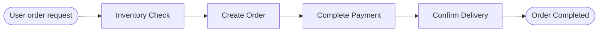

# Pre-built StateGraph Construction Functions

## Overview

LangGraph is the official orchestration framework by LangChain for building complex workflows. However, in real-world business scenarios, using LangGraph directly often requires writing a significant amount of boilerplate code (node naming, edge connection, graph compilation, etc.).

To lower the barrier to entry, this library provides two preset functions for quickly building state graphs that execute sequentially or in parallel. Developers can focus solely on implementing business logic nodes, while the functions handle the orchestration automatically.

The two functions are:

| Function Name | Functional Description | Applicable Scenarios |
|--------------|------------------------|----------------------|
| **create_sequential_graph** | Combines multiple nodes in sequence to form a sequential execution state graph | Tasks must be executed step-by-step and depend on the output of the previous step |
| **create_parallel_graph** | Combines multiple nodes in parallel to form a parallel execution state graph | Multiple tasks are independent of each other and can be executed simultaneously to improve efficiency |

## Sequential Workflow

A sequential workflow applies to scenarios where "tasks must be executed in a specific order, and subsequent steps depend on the output of previous ones." In LangGraph, each step typically corresponds to a node in the state graph.

You can use `create_sequential_graph` to combine multiple nodes into a state graph in a fixed order.

### Typical Scenario

Taking a user purchasing a product as an example, the typical process looks like this:



This process is tightly linked, and the order cannot be reversed.

These four stages (Inventory Check, Create Order, Complete Payment, Confirm Delivery) can be abstracted into independent nodes, each managed by a dedicated agent. By using `create_sequential_graph` to connect these four nodes in order, you can form a highly automated product purchase workflow with clear responsibilities.

The following example shows how to use `create_sequential_graph` to build a sequential workflow for product purchase.

First, create a chat model object. Here, we use the locally deployed `qwen3-4b` via vLLM as an example. Since its interface is compatible with OpenAI, we can directly use `create_openai_compatible_model` to construct the model class.

```python
from langchain_dev_utils.chat_models.adapters import create_openai_compatible_model

ChatVLLM = create_openai_compatible_model(
    model_provider="vllm",
    base_url="http://localhost:8000/v1",
    chat_model_cls_name="ChatVLLM",
)
```

Next, instantiate a `ChatVLLM` object for subsequent agents to call.

```python
model = ChatVLLM(model="qwen3-4b")
```

Then, create relevant tools, such as checking inventory, creating orders, making payments, etc.

??? example "Reference for Tool Implementation"

    ```python
    from langchain_core.tools import tool

    @tool
    def check_inventory(product_name: str) -> dict:
        """Check inventory"""
        return {"product_name": product_name, "in_stock": True, "available": 42}

    @tool
    def create_order(product_name: str, quantity: int) -> str:
        """Create order"""
        return f"Order ORD-10001 created, product: {product_name}, quantity: {quantity}."

    @tool
    def pay_order(order_id: str) -> str:
        """Pay order"""
        return f"Order {order_id} paid successfully."

    @tool
    def confirm_delivery(order_id: str, address: str) -> str:
        """Confirm delivery"""
        return f"Order {order_id} arranged for delivery, address: {address}."
    ```

Then, create the corresponding four sub-agents and the node functions that invoke these agents.

```python
from langchain.agents import create_agent

inventory_agent = create_agent(
    model=model,
    tools=[check_inventory],
    system_prompt="You are an inventory assistant responsible for confirming product availability. Finally, output the inventory query result.",
    name="inventory_agent",
    
)

order_agent = create_agent(
    model=model,
    tools=[create_order],
    system_prompt="You are an order assistant responsible for creating orders.",
    name="order_agent"
)

payment_agent = create_agent(
    model=model,
    tools=[pay_order],
    system_prompt="You are a payment assistant responsible for completing payments.",
    name="payment_agent"
)

delivery_agent = create_agent(
    model=model,
    tools=[confirm_delivery],
    system_prompt=(
        "You are a delivery assistant responsible for confirming delivery information and arranging shipment."
    ),
    name="delivery_agent",
    state_schema=AgentState
)

def inventory(state: AgentState):
    response = inventory_agent.invoke({"messages": state["messages"]})
    return {"messages": [AIMessage(content=response["messages"][-1].content)]}

def order(state: AgentState):
    response = order_agent.invoke({"messages": state["messages"]})
    return {"messages": [AIMessage(content=response["messages"][-1].content)]}
    
def payment(state: AgentState):
    response = payment_agent.invoke({"messages": state["messages"]})
    return {"messages": [AIMessage(content=response["messages"][-1].content)]}
    
def delivery(state: AgentState):
    response = delivery_agent.invoke({"messages": state["messages"]})
    return {"messages": [AIMessage(content=response["messages"][-1].content)]}
```

!!! info "Note"

    Although LangGraph allows adding agents (subgraphs) directly as nodes, this causes the current agent's context to include the entire execution context of previous agents, violating best practices for context engineering management. Therefore, it is recommended to wrap agents inside node functions and only output the final result.

Finally, use `create_sequential_graph` to connect these four nodes in sequence to form the state graph.

```python
from langchain_dev_utils.graph import create_sequential_graph

graph = create_sequential_graph(
    nodes=[
        inventory,
        order,
        payment,
        delivery,
    ],
    state_schema=AgentState
)
```

Execution example:

```python
response = graph.invoke(
    {
        "messages": [
            HumanMessage("I want to buy a pair of wireless headphones, quantity 2. Please place the order. Delivery address: No. X, X Road, X District, X City")
        ]
    }
)
print(response)
```

## Parallel Workflow

Parallel workflows apply to scenarios where "multiple tasks are independent of each other and can be executed simultaneously," improving overall throughput or reducing end-to-end latency through concurrent execution.

You can use `create_parallel_graph` to combine multiple nodes into a state graph in a parallel fashion.

### Typical Scenario

In a product purchase scenario, users might need multiple types of queries simultaneously, such as product details, inventory, promotions, and shipping estimation. These can be executed in parallel.

The process is as follows:


Next, we will create a parallel workflow to implement the above process.

First, create a few tools.

??? example "Reference for Tool Implementation"

    ```python
    @tool
    def get_product_detail(product_name: str) -> dict:
        """Query product details"""
        return {
            "product_name": product_name,
            "sku": "SKU-10001",
            "price": 299,
            "highlights": ["Active Noise Cancellation", "Bluetooth 5.3", "30-hour battery life"],
        }

    @tool
    def check_inventory(product_name: str) -> dict:
        """Query inventory"""
        return {"product_name": product_name, "in_stock": True, "available": 42}

    @tool
    def calculate_promotions(product_name: str, quantity: int) -> dict:
        """Calculate promotions"""
        return {
            "product_name": product_name,
            "quantity": quantity,
            "discounts": ["30 off 300", "Member 5% off"],
            "estimated_discount": 45,
        }

    @tool
    def estimate_shipping(address: str) -> dict:
        """Estimate shipping fee and time"""
        return {
            "address": address,
            "fee": 12,
            "eta_days": 2,
        }
    ```

And the corresponding sub-agents:

```python
product_agent = create_agent(
    model,
    tools=[get_product_detail],
    system_prompt="You are a product assistant responsible for parsing user needs and querying product details.",
    name="product_agent",
    state_schema=AgentState,
)

inventory_agent = create_agent(
    model,
    tools=[check_inventory],
    system_prompt="You are an inventory assistant responsible for querying inventory based on SKU.",
    name="inventory_agent",
    state_schema=AgentState,
)

promotion_agent = create_agent(
    model,
    tools=[calculate_promotions],
    system_prompt="You are a promotion assistant responsible for calculating current available promotions and estimated discounts.",
    name="promotion_agent",
    state_schema=AgentState,
)

shipping_agent = create_agent(
    model,
    tools=[estimate_shipping],
    system_prompt="You are a shipping assistant responsible for estimating shipping fees and delivery time.",
    name="shipping_agent",
    state_schema=AgentState,
)

def product(state: AgentState):
    response = product_agent.invoke({"messages": state["messages"]})
    return {"messages": [AIMessage(content=response["messages"][-1].content)]}

def inventory(state: AgentState):
    response = inventory_agent.invoke({"messages": state["messages"]})
    return {"messages": [AIMessage(content=response["messages"][-1].content)]}

def promotion(state: AgentState):
    response = promotion_agent.invoke({"messages": state["messages"]})
    return {"messages": [AIMessage(content=response["messages"][-1].content)]}

def shipping(state: AgentState):
    response = shipping_agent.invoke({"messages": state["messages"]})
    return {"messages": [AIMessage(content=response["messages"][-1].content)]}
```

Use `create_parallel_graph` to complete the orchestration of the parallel state graph.

```python
from langchain_dev_utils.graph import create_parallel_graph

graph = create_parallel_graph(
    nodes=[
       product,
       inventory,
       promotion,
       shipping,
    ],
    state_schema=AgentState,
    graph_name="parallel_graph",
)
```

Execution example:

```python
response = graph.invoke(
    {"messages": [HumanMessage("I want to buy a pair of wireless headphones, quantity 2. Delivery address: No. X, X Road, X District, X City")]}
)
print(response)
```

### On-demand Parallelism

In some cases, you may not want all nodes to participate in parallel execution, but rather "selectively run a subset of nodes in parallel based on conditions." This can be achieved by specifying a `branches_fn` (branch function).

The branch function needs to return a list of `Send` objects, where each `Send` contains the target node name and the input for that node.

#### Implementation of Router Multi-Agent Architecture

`Router` is a typical architecture for multi-agent systems: a router model analyzes user requests and decomposes tasks, then distributes them to several business agents for execution. In an order query scenario, users might care about order status, product information, or refunds simultaneously. The router model can assign requests to agents for orders, products, refunds, etc.

First, write the tools.

??? example "Reference for Tool Implementation"

    ```python
    @tool
    def list_orders() -> dict:
        """Query user order list"""
        return {
            "orders": [
                {
                    "order_id": "ORD-20250101-0001",
                    "status": "Shipped",
                    "items": [{"product_name": "Wireless Headphones", "qty": 1}],
                    "created_at": "2025-01-01 10:02:11",
                },
                {
                    "order_id": "ORD-20241215-0234",
                    "status": "Completed",
                    "items": [{"product_name": "Mechanical Keyboard", "qty": 1}],
                    "created_at": "2024-12-15 21:18:03",
                },
            ],
        }

    @tool
    def get_order_detail(order_id: str) -> dict:
        """Query order details"""
        return {
            "status": "Shipped",
            "receiver": {"name": "Zhang San", "phone": "138****0000"},
            "items": [
                {
                    "product_id": "P-10001",
                    "product_name": "Wireless Headphones",
                    "qty": 1,
                    "price": 299,
                }
            ],
        }

    @tool
    def get_shipping_trace(tracking_no: str) -> dict:
        """Query shipping trace"""
        return {
            "events": [
                {"time": "2025-01-02 09:10", "status": "Package picked up"},
                {"time": "2025-01-02 18:45", "status": "In transit"},
                {"time": "2025-01-03 11:20", "status": "Arrived at delivery station"},
            ],
        }

    @tool
    def search_products(query: str) -> dict:
        """Search products"""
        return {
            "results": [
                {
                    "product_id": "P-10001",
                    "name": "Wireless Headphones Pro",
                    "price": 299,
                    "highlights": ["ANC", "Bluetooth 5.3", "30h Battery"],
                },
                {
                    "product_id": "P-10002",
                    "name": "Wireless Headphones Lite",
                    "price": 199,
                    "highlights": ["Lightweight", "Low Latency", "24h Battery"],
                },
            ],
        }

    @tool
    def get_product_detail(product_id: str) -> dict:
        """Query product details"""
        return {
            "product_id": product_id,
            "name": "Wireless Headphones Pro",
            "price": 299,
            "specs": {"color": ["Black", "White"], "warranty_months": 12},
            "description": "True wireless headphones featuring active noise cancellation and long battery life.",
        }


    @tool
    def check_inventory(product_name: str) -> dict:
        """Query inventory"""
        return {"product_name": product_name, "in_stock": True, "available": 42}

    @tool
    def create_refund(order_id: str, reason: str) -> dict:
        """Initiate refund"""
        return {
            "refund_id": "RFD-20250103-0009",
            "status": "Submitted",
            "reason": reason,
            "estimated_days": 3,
        }

    @tool
    def get_refund_status(refund_id: str) -> dict:
        """Query refund status"""
        return {
            "refund_id": refund_id,
            "status": "Processing",
            "progress": [
                {"time": "2025-01-03 12:05", "status": "Submitted"},
                {"time": "2025-01-03 12:20", "status": "CS Reviewing"},
            ],
            "estimated_days": 2,
        }

    @tool
    def refund_policy() -> dict:
        """View refund policy"""
        return {
            "window_days": 7,
            "requirements": ["Product intact", "Accessories complete", "Provide order number"],
            "notes": ["Some promotional items do not support unconditional refunds", "Time to arrival depends on payment method"],
        }
    ```

Then, create the corresponding sub-agents.

```python
ORDER_AGENT_PROMPT = (
    "You are an order management assistant.\n"
    "You can use tools to query order lists, order details, and shipping traces.\n"
    "Prioritize using tools to get information, then draw conclusions based on tool results.\n"
    "Output requirements: Answer in Chinese, with a clear structure, list order information in items if necessary.\n"
)

order_agent = create_agent(
    model,
    system_prompt=ORDER_AGENT_PROMPT,
    tools=[list_orders, get_order_detail, get_shipping_trace],
    name="order_agent",
)

PRODUCT_AGENT_PROMPT = (
    "You are a product management assistant.\n"
    "You can use tools to search products, view product details, and check inventory.\n"
    "Prioritize using tools to get information, then make suggestions based on tool results.\n"
    "When the user's needs are unclear, ask a clarifying question first (e.g., category/budget/usage).\n"
    "Output requirements: Answer in Chinese, and give actionable next steps.\n"
)


product_agent = create_agent(
    model,
    system_prompt=PRODUCT_AGENT_PROMPT,
    tools=[search_products, get_product_detail, check_inventory],
    name="product_agent",
)

REFUND_AGENT_PROMPT = (
    "You are a refund management assistant.\n"
    "You can use tools to initiate refunds, check refund status, and view refund policies.\n"
    "Prioritize using tools to get information; if the user is missing key fields (e.g., order number), ask for them first.\n"
    "Output requirements: Answer in Chinese, clearly stating refund progress/required materials/estimated time.\n"
)

refund_agent = create_agent(
    model,
    system_prompt=REFUND_AGENT_PROMPT,
    tools=[create_refund, get_refund_status, refund_policy],
    name="refund_agent",
)

def order(state: AgentState):
    response = order_agent.invoke({"messages": state["messages"]})
    return {"messages": [AIMessage(content=response["messages"][-1].content)]}

def product(state: AgentState):
    response = product_agent.invoke({"messages": state["messages"]})
    return {"messages": [AIMessage(content=response["messages"][-1].content)]}

def refund(state: AgentState):
    response = refund_agent.invoke({"messages": state["messages"]})
    return {"messages": [AIMessage(content=response["messages"][-1].content)]}
```

Next, write the branch function: The router model generates the names of the sub-agents to be executed based on the request, along with the task description to be sent to that sub-agent.

```python
from typing import Literal, cast

from langchain_core.messages import SystemMessage
from langgraph.types import Send
from pydantic import BaseModel, Field
from typing_extensions import TypedDict


class RouterInput(TypedDict):
    query: str


class RouterState(AgentState):
    query: str


ROUTER_SYSTEM_PROMPT = (
    "You are a Router model, responsible only for splitting user questions and distributing them to the appropriate business sub-agents.\n"
    "Available business domains are only: order (Order), product (Product), refund (Refund).\n"
    "You must output a classifications list (used for calling multiple sub-agents in parallel).\n"
    "Rules:\n"
    "1) source must be one of the above three;\n"
    "2) query must be a directly executable task description sent to that sub-agent;\n"
    "3) If a user sentence involves multiple business domains simultaneously (e.g., 'check order' + 'look at product' + 'ask refund'), it must be split into multiple classifications for parallel execution;\n"
    "4) If unable to judge, prioritize 'product', and pass the question to it as is.\n"
    "Example A: User: 'Check tracking for ORD-1 and see if these headphones are in stock' -> Return 2 items: order(query tracking) + product(query inventory).\n"
    "Example B: User: 'I want to return ORD-1, how long for refund' -> Return 1 item: refund(initiate/query refund).\n"
    "Example C: User: 'I want to know the specs of these headphones' -> Return 1 item: product(query details).\n"
)


class Classification(TypedDict):
    """A routing decision: which agent to call and with what query."""

    source: Literal["order", "refund", "product"]
    query: str


class ClassificationResult(BaseModel):
    """Result of classifying a user query into sub-problems for agents."""

    classifications: list[Classification] = Field(
        description="List of agents to call and their corresponding sub-questions"
    )


def branch_fn(state: RouterState) -> list[Send]:
    structured_llm = model.with_structured_output(ClassificationResult)

    query = state.get("messages")[-1].content
    classification_result = cast(
        ClassificationResult,
        structured_llm.invoke(
            [
                SystemMessage(ROUTER_SYSTEM_PROMPT),
                HumanMessage(query),
            ]
        ),
    )

    classifications = classification_result.classifications or []
    if not classifications:
        classifications = [{"source": "product", "query": query}]

    sends: list[Send] = []
    for res in classifications:
        source = res.get("source")
        if source not in {"order", "refund", "product"}:
            source = "product"
        sends.append(Send(f"{source}", {"messages": [HumanMessage(res.get("query"))]}))
    return sends
```

Finally, use `create_parallel_graph` to complete the orchestration of the parallel state graph, passing in the branch function.

```python
graph = create_parallel_graph(
    nodes=[
        order,
        refund,
        product,
    ],
    state_schema=AgentState,
    graph_name="parallel_graph",
    branches_fn=branch_fn,
)
```

Execution example:

```python
response = graph.invoke(
    {
        "messages": [HumanMessage("Hello, I want to check the product I purchased before")],
    }
)
print(response)

response = graph.invoke(
    {
        "messages": [HumanMessage("Recommend a pair of wireless headphones suitable for commuting and check inventory; also, tell me your product refund policy?")],
    }
)
print(response)
```

!!! tip "Tip"

    - **When the `branches_fn` parameter is NOT passed**: All nodes will execute in parallel.
    - **When the `branches_fn` parameter IS passed**: Which nodes execute is determined by the return value of this function.