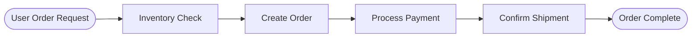
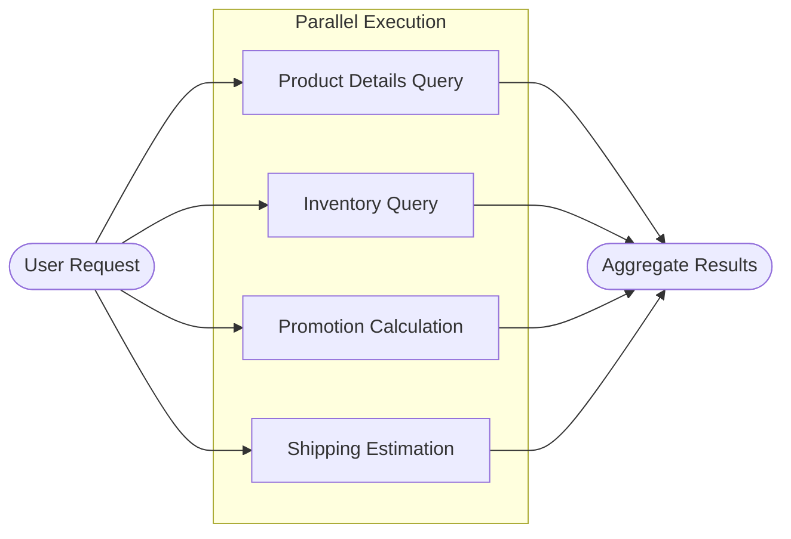
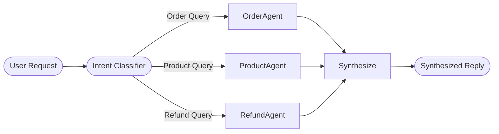

# Predefined StateGraph Builder Functions

## Overview

LangGraph is an official orchestration framework by LangChain for building complex workflows. However, in real-world business scenarios, using LangGraph directly often requires writing a significant amount of boilerplate code (node naming, edge connection, graph compilation, etc.).

To reduce the barrier to entry, this library provides two predefined functions for quickly constructing state graphs for sequential or parallel execution. Developers only need to focus on implementing business nodes, and the function handles the orchestration automatically.

The two functions are:

| Function Name | Description | Use Case |
|---------------|-------------|----------|
| **create_sequential_graph** | Combines multiple nodes in sequence to form a sequential execution state graph | Tasks that must be executed step-by-step and depend on the output of the previous step |
| **create_parallel_graph** | Combines multiple nodes in parallel to form a parallel execution state graph | Multiple tasks are independent of each other and can be executed simultaneously to improve efficiency |

## Sequential Workflow

Sequential workflows are suitable for scenarios where "tasks must be executed in a specific order, and the subsequent step depends on the output of the previous one." In LangGraph, each step typically corresponds to a state graph node.

You can use `create_sequential_graph` to combine multiple nodes into a state graph in a fixed order.

### Typical Scenario

Taking user product purchase as an example, the typical workflow is as follows:



This workflow is tightly linked, and the order cannot be reversed.

These four stages (Inventory Check, Create Order, Process Payment, Confirm Shipment) can be abstracted as independent nodes, each executed by a dedicated agent.
Using `create_sequential_graph`, you can connect these four nodes in sequence to form a highly automated product purchase workflow with clear responsibilities.

The following example shows how to use `create_sequential_graph` to build a sequential product purchase workflow.

First, create the chat model object. Here, we use the locally deployed `qwen3-4b` via vLLM as an example. Since its interface is compatible with OpenAI, we can directly use `create_openai_compatible_model` to construct the model class.

```python
from langchain_dev_utils.chat_models.adapters import create_openai_compatible_model

ChatVLLM = create_openai_compatible_model(
    model_provider="vllm",
    base_url="http://localhost:8000/v1",
    chat_model_cls_name="ChatVLLM",
)
```
Then instantiate a `ChatVLLM` object for subsequent agent calls.

```python
model = ChatVLLM(model="qwen3-4b")
```
Next, create relevant tools, such as checking inventory, creating orders, processing payments, etc.

??? example "Reference implementation for tools"

    ```python
    from langchain_core.tools import tool

    @tool
    def check_inventory(product_name: str) -> dict:
        """Check inventory"""
        return {"product_name": product_name, "in_stock": True, "available": 42}

    @tool
    def create_order(product_name: str, quantity: int) -> str:
        """Create order"""
        return f"Order ORD-10001 created, product: {product_name}, quantity: {quantity}."

    @tool
    def pay_order(order_id: str) -> str:
        """Pay order"""
        return f"Order {order_id} payment successful."

    @tool
    def confirm_delivery(order_id: str, address: str) -> str:
        """Confirm shipment"""
        return f"Order {order_id} arranged for shipment, address: {address}."
    ```

Then create the corresponding four sub-agents and node functions that invoke these agents.

```python
from langchain.agents import create_agent

inventory_agent = create_agent(
    model=model,
    tools=[check_inventory],
    system_prompt="You are an inventory assistant responsible for confirming if a product is in stock. Finally, please output the inventory check result.",
    name="inventory_agent",
)

order_agent = create_agent(
    model=model,
    tools=[create_order],
    system_prompt="You are an ordering assistant responsible for creating orders.",
    name="order_agent"
)

payment_agent = create_agent(
    model=model,
    tools=[pay_order],
    system_prompt="You are a payment assistant responsible for completing payments.",
    name="payment_agent"
)

delivery_agent = create_agent(
    model=model,
    tools=[confirm_delivery],
    system_prompt=(
        "You are a shipping assistant responsible for confirming shipment info and arranging delivery."
    ),
    name="delivery_agent",
    state_schema=AgentState
)

def inventory(state: AgentState):
    response = inventory_agent.invoke({"messages": state["messages"]})
    return {"messages": [AIMessage(content=response["messages"][-1].content)]}

def order(state: AgentState):
    response = order_agent.invoke({"messages": state["messages"]})
    return {"messages": [AIMessage(content=response["messages"][-1].content)]}
    
def payment(state: AgentState):
    response = payment_agent.invoke({"messages": state["messages"]})
    return {"messages": [AIMessage(content=response["messages"][-1].content)]}
    
def delivery(state: AgentState):
    response = delivery_agent.invoke({"messages": state["messages"]})
    return {"messages": [AIMessage(content=response["messages"][-1].content)]}
```

!!! info "Note"

    Although LangGraph allows adding agents (sub-graphs) directly as nodes to the graph, this causes the current agent's context to include the entire runtime context of previous agents, which violates best practices for context engineering management. Therefore, it is recommended to encapsulate agents within nodes and only output the final result.

Finally, use `create_sequential_graph` to connect these four nodes in sequence into a state graph.

```python
from langchain_dev_utils.graph import create_sequential_graph

graph = create_sequential_graph(
    nodes=[
        inventory,
        order,
        payment,
        delivery,
    ],
    state_schema=AgentState
)
```
Running example:

```python
response = graph.invoke(
    {
        "messages": [
            HumanMessage("I want to buy a pair of wireless headphones, quantity 2, please place the order, shipping address is No. X, X Road, X District, X City")
        ]
    }
)
print(response)
```


## Parallel Workflow

Parallel workflows are suitable for scenarios where "multiple tasks are independent of each other and can be executed simultaneously," improving overall throughput or reducing end-to-end latency through concurrent execution.

You can use `create_parallel_graph` to combine multiple nodes into a state graph in a parallel manner.

### Typical Scenario

In a product purchase scenario, users might need multiple queries simultaneously, such as product details, inventory, promotions, and shipping estimation, which can be executed in parallel.

The process is as follows:



Next, we create a parallel workflow to implement the above process.

First, create a few tools.

??? example "Reference implementation for tools"

    ```python
    @tool
    def get_product_detail(product_name: str) -> dict:
        """Query product details"""
        return {
            "product_name": product_name,
            "sku": "SKU-10001",
            "price": 299,
            "highlights": ["Active Noise Cancellation", "Bluetooth 5.3", "30-hour battery life"],
        }

    @tool
    def check_inventory(product_name: str) -> dict:
        """Check inventory"""
        return {"product_name": product_name, "in_stock": True, "available": 42}

    @tool
    def calculate_promotions(product_name: str, quantity: int) -> dict:
        """Calculate promotions"""
        return {
            "product_name": product_name,
            "quantity": quantity,
            "discounts": ["30 off 300", "Member 5% off"],
            "estimated_discount": 45,
        }

    @tool
    def estimate_shipping(address: str) -> dict:
        """Estimate shipping fee and time"""
        return {
            "address": address,
            "fee": 12,
            "eta_days": 2,
        }
    ```

And the corresponding sub-agents:

```python
product_agent = create_agent(
    model,
    tools=[get_product_detail],
    system_prompt="You are a product assistant responsible for parsing user needs and querying product details.",
    name="product_agent",
    state_schema=AgentState,
)

inventory_agent = create_agent(
    model,
    tools=[check_inventory],
    system_prompt="You are an inventory assistant responsible for checking inventory based on SKU.",
    name="inventory_agent",
    state_schema=AgentState,
)

promotion_agent = create_agent(
    model,
    tools=[calculate_promotions],
    system_prompt="You are a promotion assistant responsible for calculating current available promotions and estimated discounts.",
    name="promotion_agent",
    state_schema=AgentState,
)

shipping_agent = create_agent(
    model,
    tools=[estimate_shipping],
    system_prompt="You are a shipping assistant responsible for estimating shipping fees and delivery times.",
    name="shipping_agent",
    state_schema=AgentState,
)

def product(state: AgentState):
    response = product_agent.invoke({"messages": state["messages"]})
    return {"messages": [AIMessage(content=response["messages"][-1].content)]}

def inventory(state: AgentState):
    response = inventory_agent.invoke({"messages": state["messages"]})
    return {"messages": [AIMessage(content=response["messages"][-1].content)]}

def promotion(state: AgentState):
    response = promotion_agent.invoke({"messages": state["messages"]})
    return {"messages": [AIMessage(content=response["messages"][-1].content)]}

def shipping(state: AgentState):
    response = shipping_agent.invoke({"messages": state["messages"]})
    return {"messages": [AIMessage(content=response["messages"][-1].content)]}
```

Use `create_parallel_graph` to complete the orchestration of the parallel state graph.

```python
from langchain_dev_utils.graph import create_parallel_graph

graph = create_parallel_graph(
    nodes=[
       product,
       inventory,
       promotion,
       shipping,
    ],
    state_schema=AgentState,
    graph_name="parallel_graph",
)
```
Running example:

```python
response = graph.invoke(
    {"messages": [HumanMessage("I want to buy a pair of wireless headphones, quantity 2, shipping address No. X, X Road, X District, X City")]}
)
print(response)
```


### Dynamic Parallelism (On-demand Parallelism)

In some cases, you may not want all nodes to participate in parallel execution, but rather "selectively run a subset of nodes in parallel based on conditions." You can achieve this by specifying a `branches_fn` (branch function).

The branch function needs to return a list of `Send` objects, where each `Send` contains the target node name and the input for that node.


#### Router Multi-Agent Architecture

The on-demand parallelism feature can be used to implement the core part of a Router multi-agent architecture.

In multi-agent systems, the `Router` architecture achieves efficient parallel processing by decomposing complex tasks and distributing them to specialized sub-agents. The architecture consists of three core steps:

1.  **Intent Recognition**: A router model analyzes the user request, decomposes the task, and determines which agents to invoke.

2.  **Parallel Execution**: Multiple business agents process sub-tasks simultaneously.

3.  **Result Synthesis**: The responses from sub-agents are integrated into a final answer.

In an order inquiry scenario, users might care about order status, product information, or refund policies simultaneously. The system can invoke the order, product, and refund agents in parallel, then provide a unified reply.




**1. Environment Setup and Tool Definition**

First, define the tools needed by the business agents.

??? example "Click to expand tool implementation code"

    ```python
    from langchain_core.tools import tool

    @tool
    def list_orders() -> dict:
        """Query user order list"""
        return {
            "orders": [
                {
                    "order_id": "ORD-20250101-0001",
                    "status": "Shipped",
                    "items": [{"product_name": "Wireless Headphones", "qty": 1}],
                    "created_at": "2025-01-01 10:02:11",
                },
                {
                    "order_id": "ORD-20241215-0234",
                    "status": "Completed",
                    "items": [{"product_name": "Mechanical Keyboard", "qty": 1}],
                    "created_at": "2024-12-15 21:18:03",
                },
            ],
        }

    @tool
    def get_order_detail(order_id: str) -> dict:
        """Query order details"""
        return {
            "status": "Shipped",
            "receiver": {"name": "Zhang San", "phone": "138****0000"},
            "items": [
                {
                    "product_id": "P-10001",
                    "product_name": "Wireless Headphones",
                    "qty": 1,
                    "price": 299,
                }
            ],
        }

    @tool
    def get_shipping_trace(tracking_no: str) -> dict:
        """Query shipping trajectory"""
        return {
            "events": [
                {"time": "2025-01-02 09:10", "status": "Package Picked Up"},
                {"time": "2025-01-02 18:45", "status": "In Transit"},
                {"time": "2025-01-03 11:20", "status": "Arrived at Delivery Station"},
            ],
        }

    @tool
    def search_products(query: str) -> dict:
        """Search products"""
        return {
            "results": [
                {
                    "product_id": "P-10001",
                    "name": "Wireless Headphones Pro",
                    "price": 299,
                    "highlights": ["ANC", "Bluetooth 5.3", "30h Battery"],
                },
                {
                    "product_id": "P-10002",
                    "name": "Wireless Headphones Lite",
                    "price": 199,
                    "highlights": ["Lightweight", "Low Latency", "24h Battery"],
                },
            ],
        }

    @tool
    def get_product_detail(product_id: str) -> dict:
        """Query product details"""
        return {
            "product_id": product_id,
            "name": "Wireless Headphones Pro",
            "price": 299,
            "specs": {"color": ["Black", "White"], "warranty_months": 12},
            "description": "True wireless headphones featuring noise cancellation and long battery life.",
        }

    @tool
    def check_inventory(product_name: str) -> dict:
        """Check inventory"""
        return {"product_name": product_name, "in_stock": True, "available": 42}

    @tool
    def create_refund(order_id: str, reason: str) -> dict:
        """Initiate refund"""
        return {
            "refund_id": "RFD-20250103-0009",
            "status": "Submitted",
            "reason": reason,
            "estimated_days": 3,
        }

    @tool
    def get_refund_status(refund_id: str) -> dict:
        """Query refund status"""
        return {
            "refund_id": refund_id,
            "status": "Processing",
            "progress": [
                {"time": "2025-01-03 12:05", "status": "Submitted"},
                {"time": "2025-01-03 12:20", "status": "CS Reviewing"},
            ],
            "estimated_days": 2,
        }

    @tool
    def refund_policy() -> dict:
        """View refund policy"""
        return {
            "window_days": 7,
            "requirements": ["Product intact", "All accessories included", "Provide order number"],
            "notes": ["Some promotional items do not support no-reason returns", "Arrival time depends on payment channel"],
        }
    ```

**2. Define State Schema**

`RouterState` represents the state schema of the final graph, while `AgentInput` and `AgentOutput` define the input and output states of the sub-agent nodes respectively.

```python
import operator
from typing import Annotated, Literal

from typing_extensions import TypedDict


class AgentInput(TypedDict):
    """Sub-agent input structure"""
    query: str


class AgentOutput(TypedDict):
    """Sub-agent output structure"""
    source: str
    result: str


class Classification(TypedDict):
    """Routing classification result"""
    source: Literal["order", "refund", "product"]
    query: str


class RouterState(TypedDict):
    """Global state schema"""
    query: str
    classifications: list[Classification]
    results: Annotated[list[AgentOutput], operator.add] 
    final_answer: str
```

**3. Create Sub-Agents**

Use LangChain's `create_agent` to quickly build three business agents, binding them with corresponding tools and prompts.

```python
from langchain.agents import create_agent
from langchain_core.messages import HumanMessage

ORDER_AGENT_PROMPT = (
    "You are an order management assistant.\n"
    "You can use tools to check order lists, order details, and shipping trajectories.\n"
    "Prioritize using tools to get information, then provide conclusions based on tool results.\n"
    "Output requirements: Answer in Chinese, clear structure, list order information with bullet points if necessary.\n"
)

order_agent = create_agent(
    model,
    system_prompt=ORDER_AGENT_PROMPT,
    tools=[list_orders, get_order_detail, get_shipping_trace],
    name="order_agent",
)

PRODUCT_AGENT_PROMPT = (
    "You are a product management assistant.\n"
    "You can use tools to search products, view product details, and check inventory.\n"
    "Prioritize using tools to get information, then give suggestions based on tool results.\n"
    "When user needs are unclear, ask a clarification question first (e.g., category/budget/usage).\n"
    "Output requirements: Answer in Chinese, give actionable next steps.\n"
)

product_agent = create_agent(
    model,
    system_prompt=PRODUCT_AGENT_PROMPT,
    tools=[search_products, get_product_detail, check_inventory],
    name="product_agent",
)

REFUND_AGENT_PROMPT = (
    "You are a refund management assistant.\n"
    "You can use tools to initiate refunds, check refund status, and view refund policies.\n"
    "Prioritize using tools to get information; if the user is missing key fields (e.g., order number), ask for them first.\n"
    "Output requirements: Answer in Chinese, clearly state refund progress/required materials/estimated time.\n"
)

refund_agent = create_agent(
    model,
    system_prompt=REFUND_AGENT_PROMPT,
    tools=[create_refund, get_refund_status, refund_policy],
    name="refund_agent",
)
```

**4. Encapsulate Agent Invocation Logic**

Encapsulate the agent invocation logic into node functions. Each function is responsible for invoking a specific agent and formatting the result into the `results` field.

```python
def order(state: AgentInput):
    response = order_agent.invoke({"messages": [HumanMessage(content=state["query"])]})
    return {
        "results": [{"source": "order", "result": response["messages"][-1].content}]
    }

def product(state: AgentInput):     
    response = product_agent.invoke(
        {"messages": [HumanMessage(content=state["query"])]}
    )
    return {
        "results": [{"source": "product", "result": response["messages"][-1].content}]
    }

def refund(state: AgentInput):
    response = refund_agent.invoke({"messages": [HumanMessage(content=state["query"])]})
    return {
        "results": [{"source": "refund", "result": response["messages"][-1].content}]
    }
```

**5. Implement Routing and Branching Logic**

Here, we use the **on-demand parallelism** feature. We define two nodes:
1.  **`classify_query`**: Uses an LLM to perform intent recognition, outputting the list of agents to invoke and the task content.
2.  **`route_to_agents`**: Generates a list of `Send` objects based on the classification results, deciding which nodes to execute in parallel.

```python
from typing import cast
from langchain_core.messages import SystemMessage
from pydantic import BaseModel, Field
from langgraph.constants import Send

class ClassificationResult(BaseModel):
    classifications: list[Classification] = Field(
        description="List of agents to invoke and their corresponding sub-questions"
    )

ROUTER_SYSTEM_PROMPT = (
    "You are a Router model, only responsible for splitting user questions and distributing them to appropriate business sub-agents.\n"
    "Available business domains are only: order (orders), product (products), refund (refunds).\n"
    "You must output a classifications list (used to invoke multiple sub-agents in parallel).\n"
    "Rules:\n"
    "1) source must be one of the three above;\n"
    "2) query must be a directly executable task description sent to that sub-agent;\n"
    "3) If a user sentence involves multiple business domains simultaneously (e.g., 'check order' + 'view product' + 'ask refund'), it must be split into multiple classifications for parallel execution;\n"
    "4) If unsure, prioritize product, and pass the question to it as is.\n"
    "Example A: User: 'Check shipping for ORD-1 and see if these headphones are in stock' -> Return 2 items: order(check shipping) + product(check inventory).\n"
    "Example B: User: 'I want to return ORD-1, how long for refund' -> Return 1 item: refund(initiate/check refund).\n"
    "Example C: User: 'I want to know the specs of this headphone' -> Return 1 item: product(query details).\n"
)

def classify_query(state: RouterState):
    structured_llm = model.with_structured_output(ClassificationResult)

    classify_result = cast(
        ClassificationResult,
        structured_llm.invoke(
            [
                SystemMessage(ROUTER_SYSTEM_PROMPT),
                HumanMessage(state["query"]),
            ]
        ),
    )

    return {"classifications": classify_result.classifications}

def route_to_agents(state: RouterState) -> list[Send]:
    """Generate instructions for parallel execution based on classification results"""
    return [Send(c["source"], {"query": c["query"]}) for c in state["classifications"]]
```

**6. Orchestrate Parallel Graph and Aggregation**

Use `create_parallel_graph` to create a parallel sub-graph. Here, the `branches_fn` parameter is passed to implement dynamic parallel execution based on conditions.

```python hl_lines="10"
from langchain_dev_utils.graph import create_parallel_graph

router_graph = create_parallel_graph(
    nodes=[
        order,
        product,
        refund,
    ],
    state_schema=RouterState,
    branches_fn=route_to_agents, # Core logic: function determines which branches to run
)
```

Next, write the aggregation node `synthesize_results` to integrate the results of parallel execution into a coherent answer.

```python
SYNTHESIS_SYSTEM_PROMPT = (
    "Synthesize these results to answer the original question: {query}\n"
    "- Merge information from multiple sources, avoid redundancy\n"
    "- Highlight the most relevant and actionable information\n"
    "- Note any discrepancies between sources\n"
    "- Keep the answer concise and organized\n"
)

def synthesize_results(state: RouterState) -> dict:
    if not state["results"]:
        return {"final_answer": "No results found from any knowledge source."}

    # Format outputs from each sub-agent
    formatted = [
        f"**From {r['source'].title()}:**\n{r['result']}" for r in state["results"]
    ]

    synthesis_response = model.invoke(
        [
            {
                "role": "system",
                "content": SYNTHESIS_SYSTEM_PROMPT.format(query=state["query"]),
            },
            {"role": "user", "content": "\n\n".join(formatted)},
        ]
    )

    return {"final_answer": synthesis_response.content}
```

**7. Build the Final StateGraph**

Finally, use `create_sequential_graph` to connect "Intent Classification -> On-demand Parallel -> Result Synthesis" into a complete application flow.

```python
from langchain_dev_utils.graph import create_sequential_graph

graph = create_sequential_graph(
    nodes=[
        classify_query,
        router_graph,
        synthesize_results,
    ],
    state_schema=RouterState,
)
```

**8. Running Examples**

```python
# Example 1: Single intent (Product query)
response = graph.invoke({"query": "Hello, I want to check the product I purchased before"})
print(response["final_answer"])

# Example 2: Mixed intent (Product query + Refund policy), will trigger parallel execution
response = graph.invoke({"query": "Recommend a wireless headset suitable for commuting and check stock; also, tell me your product refund policy?"})
print(response["final_answer"])
```