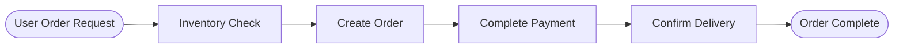
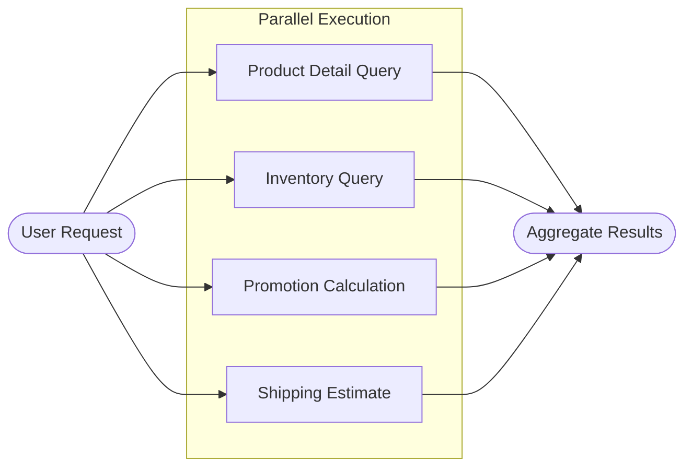

# State Graph Construction

## Overview

LangGraph is the official orchestration framework by LangChain for building complex workflows. However, using LangGraph directly comes with a steep learning curve. Therefore, this library provides two preset functions to build state graphs for sequential or parallel execution. Developers only need to write the business logic for nodes, while edge connections, graph compilation, and state management are handled automatically.

The two specific functions are as follows:

| Function Name | Functionality | Use Case |
|---------------|---------------|----------|
| **create_sequential_graph** | Combines multiple nodes sequentially to form a sequential execution state graph. | Tasks need to be executed step-by-step and depend on the output of the previous step. |
| **create_parallel_graph** | Combines multiple nodes in parallel to form a parallel execution state graph. | Multiple tasks are independent and can be executed simultaneously to improve efficiency. |

## Sequential Orchestration

Sequential orchestration breaks down complex tasks into continuous, ordered sub-tasks. In LangGraph, each sub-task corresponds to a node in the state graph.

You can use `create_sequential_graph` to combine multiple nodes in a sequential manner. The parameters for this function are as follows:

| Parameter | Description |
|-----------|-------------|
| `nodes` | The list of nodes to combine, which can be node functions or tuples consisting of a node name and a node function.<br><br>**Type**: `list[Node]`<br>**Required**: Yes |
| `state_schema` | The State Schema of the final generated graph.<br><br>**Type**: `type[StateT]`<br>**Required**: Yes |
| `graph_name` | The name of the final generated graph.<br><br>**Type**: `Optional[str]`<br>**Required**: No |
| `context_schema` | The Context Schema of the final generated graph.<br><br>**Type**: `type[ContextT]`<br>**Required**: No |
| `input_schema` | The Input Schema of the final generated graph.<br><br>**Type**: `type[InputT]`<br>**Required**: No |
| `output_schema` | The Output Schema of the final generated graph.<br><br>**Type**: `type[OutputT]`<br>**Required**: No |
| `checkpointer` | The Checkpointer of the final generated graph.<br><br>**Type**: `Checkpointer`<br>**Required**: No |
| `store` | The Store of the final generated graph.<br><br>**Type**: `BaseStore`<br>**Required**: No |
| `cache` | The Cache of the final generated graph.<br><br>**Type**: `BaseCache`<br>**Required**: No |

### Typical Application Scenario

Taking a user purchasing a product as an example, the typical flow is as follows:



This flow is tightly coupled, and the sequence cannot be reversed.

These four steps (Inventory Check, Create Order, Complete Payment, Confirm Delivery) can be abstracted into independent nodes, with each being executed by a dedicated agent. Using `create_sequential_graph` to orchestrate these four nodes sequentially creates a highly automated product purchase workflow with clear responsibilities.

### Basic Example

The following example demonstrates how to use `create_sequential_graph` to build a sequential product purchase workflow:

First, create the chat model object. Here we use `qwen3-4b` deployed locally via vLLM as an example. Since its interface is compatible with OpenAI, we can directly construct the model class using `create_openai_compatible_model`.

```python
from langchain_dev_utils.chat_models.adapters import create_openai_compatible_model

ChatVLLM = create_openai_compatible_model(
    model_provider="vllm",
    base_url="http://localhost:8000/v1",
    chat_model_cls_name="ChatVLLM",
)
```

Next, instantiate a `ChatVLLM` object for subsequent agent calls.

```python
model = ChatVLLM(model="qwen3-4b")
```

Then create the relevant tools, such as checking inventory, creating orders, processing payments, etc.

??? example "Reference for Tool Implementation"

    ```python
    from langchain_core.tools import tool

    @tool
    def check_inventory(product_name: str) -> dict:
        """Query inventory"""
        return {"product_name": product_name, "in_stock": True, "available": 42}

    @tool
    def create_order(product_name: str, quantity: int) -> str:
        """Create order"""
        return f"Order ORD-10001 created, product: {product_name}, quantity: {quantity}."

    @tool
    def pay_order(order_id: str) -> str:
        """Pay for order"""
        return f"Order {order_id} payment successful."

    @tool
    def confirm_delivery(order_id: str, address: str) -> str:
        """Confirm delivery"""
        return f"Order {order_id} arranged for delivery, address: {address}."
    ```

Then create the four corresponding sub-agents.

```python
from langchain.agents import create_agent

inventory_agent = create_agent(
    model=model,
    tools=[check_inventory],
    system_prompt="You are an inventory assistant responsible for confirming product availability. Please output the inventory query result.",
    name="inventory_agent",
    
)

order_agent = create_agent(
    model=model,
    tools=[create_order],
    system_prompt="You are an order assistant responsible for creating orders.",
    name="order_agent"
)

payment_agent = create_agent(
    model=model,
    tools=[pay_order],
    system_prompt="You are a payment assistant responsible for completing payment.",
    name="payment_agent"
)

delivery_agent = create_agent(
    model=model,
    tools=[confirm_delivery],
    system_prompt=(
        "You are a delivery assistant responsible for confirming delivery information and arranging shipment."
    ),
    name="delivery_agent",
    state_schema=AgentState
)
```

Next, write a utility function to create nodes that invoke agents.

```python
from langchain.agents import AgentState
from langchain_core.messages import AIMessage, HumanMessage
from langgraph.graph.state import CompiledStateGraph


def create_call_agent_node(agent: CompiledStateGraph):
    def call_agent(state: AgentState) -> dict:
        response = agent.invoke({"messages": state["messages"]})
        return {"messages": [AIMessage(content=response["messages"][-1].content)]}
    return call_agent
```

Finally, use `create_sequential_graph` to orchestrate these four nodes in sequence.

```python
from langchain_dev_utils.graph import create_sequential_graph

graph = create_sequential_graph(
    nodes=[
        ("inventory", create_call_agent_node(inventory_agent)),
        ("order", create_call_agent_node(order_agent)),
        ("payment", create_call_agent_node(payment_agent)),
        ("delivery", create_call_agent_node(delivery_agent)),
    ],
    state_schema=AgentState
)
```

Run a test:

```python
response = graph.invoke(
    {
        "messages": [
            HumanMessage("I want to buy a pair of wireless headphones, quantity 2. Please place the order. Delivery address is X City, X District, X Road, No. X")
        ]
    }
)
print(response)
```

!!! info "Note"

    Although LangGraph allows adding agents (sub-graphs) directly as nodes in a graph, this causes the context of the current agent to include the entire execution context of previous agents, which violates best practices for context engineering management. Therefore, it is recommended to wrap agents within nodes and only output the final result.

## Parallel Orchestration

Parallel orchestration combines multiple nodes to execute tasks concurrently, thereby improving execution efficiency.

You can use `create_parallel_graph` to combine multiple nodes in a parallel manner to achieve parallel execution. The parameters for this function are as follows:

| Parameter | Description |
|-----------|-------------|
| `nodes` | The list of nodes to combine, which can be node functions or tuples consisting of a node name and a node function.<br><br>**Type**: `list[Node]`<br>**Required**: Yes |
| `state_schema` | The State Schema of the final generated graph.<br><br>**Type**: `type[StateT]`<br>**Required**: Yes |
| `graph_name` | The name of the final generated graph.<br><br>**Type**: `Optional[str]`<br>**Required**: No |
| `context_schema` | The Context Schema of the final generated graph.<br><br>**Type**: `type[ContextT]`<br>**Required**: No |
| `input_schema` | The Input Schema of the final generated graph.<br><br>**Type**: `type[InputT]`<br>**Required**: No |
| `output_schema` | The Output Schema of the final generated graph.<br><br>**Type**: `type[OutputT]`<br>**Required**: No |
| `checkpointer` | The Checkpointer of the final generated graph.<br><br>**Type**: `Checkpointer`<br>**Required**: No |
| `store` | The Store of the final generated graph.<br><br>**Type**: `BaseStore`<br>**Required**: No |
| `cache` | The Cache of the final generated graph.<br><br>**Type**: `BaseCache`<br>**Required**: No |
| `branches_fn` | Parallel branch function that returns a list of Send objects to control parallel execution.<br><br>**Type**: `Callable`<br>**Required**: No |

### Typical Application Scenario

In a product purchase scenario, a user might need multiple queries simultaneously, such as product details, inventory, promotions, and shipping estimates. These can be executed in parallel.

The flow is as follows:



### Basic Example

First, create a few tools.

??? example "Reference for Tool Implementation"

    ```python
    @tool
    def get_product_detail(product_name: str) -> dict:
        """Query product details"""
        return {
            "product_name": product_name,
            "sku": "SKU-10001",
            "price": 299,
            "highlights": ["Active Noise Cancellation", "Bluetooth 5.3", "30-hour Battery"],
        }

    @tool
    def check_inventory(product_name: str) -> dict:
        """Query inventory"""
        return {"product_name": product_name, "in_stock": True, "available": 42}

    @tool
    def calculate_promotions(product_name: str, quantity: int) -> dict:
        """Calculate promotions"""
        return {
            "product_name": product_name,
            "quantity": quantity,
            "discounts": ["Save 30 on orders over 300", "Member 5% off"],
            "estimated_discount": 45,
        }

    @tool
    def estimate_shipping(address: str) -> dict:
        """Estimate shipping fee and time"""
        return {
            "address": address,
            "fee": 12,
            "eta_days": 2,
        }
    ```

And the corresponding sub-agents:

```python
product_agent = create_agent(
    model,
    tools=[get_product_detail],
    system_prompt="You are a product assistant responsible for parsing user requests and querying product details.",
    name="product_agent",
    state_schema=AgentState,
)

inventory_agent = create_agent(
    model,
    tools=[check_inventory],
    system_prompt="You are an inventory assistant responsible for checking inventory based on SKU.",
    name="inventory_agent",
    state_schema=AgentState,
)

promotion_agent = create_agent(
    model,
    tools=[calculate_promotions],
    system_prompt="You are a promotion assistant responsible for calculating available discounts and estimated savings.",
    name="promotion_agent",
    state_schema=AgentState,
)

shipping_agent = create_agent(
    model,
    tools=[estimate_shipping],
    system_prompt="You are a delivery assistant responsible for estimating shipping fees and delivery times.",
    name="shipping_agent",
    state_schema=AgentState,
)
```

Use `create_parallel_graph` to complete the orchestration of the parallel state graph.

```python
from langchain_dev_utils.graph import create_parallel_graph

graph = create_parallel_graph(
    nodes=[
       ( "product", create_call_agent_node(product_agent)),
       ( "inventory", create_call_agent_node(inventory_agent)),
       ( "promotion", create_call_agent_node(promotion_agent)),
       ( "shipping", create_call_agent_node(shipping_agent)),
    ],
    state_schema=AgentState,
    graph_name="parallel_graph",
)
```

Run a test:

```python
response = graph.invoke(
    {"messages": [HumanMessage("I want to buy a pair of wireless headphones, quantity 2. Delivery address: X City, X District, X Road, No. X")]}
)
print(response)
```

### Using Branch Functions to Specify Sub-graphs for Parallel Execution

In some cases, you may not want all nodes to execute in parallel, but rather execute specific nodes in parallel based on conditions. This requires using the `branches_fn` parameter to specify a branch function. The branch function must return a list of `Send` objects, where each `Send` contains the node name and the input payload.

#### Application Scenario

`Router` is a typical architecture for multi-agent systems: a router model analyzes user requests and breaks down tasks, then distributes them to several business agents for execution. In an order query scenario, a user might care about order status, product information, or refunds simultaneously. The router model can distribute requests to order, product, and refund agents.

First, write the tools.

??? example "Reference for Tool Implementation"

    ```python
    @tool
    def list_orders() -> dict:
        """Query user order list"""
        return {
            "orders": [
                {
                    "order_id": "ORD-20250101-0001",
                    "status": "Shipped",
                    "items": [{"product_name": "Wireless Headphones", "qty": 1}],
                    "created_at": "2025-01-01 10:02:11",
                },
                {
                    "order_id": "ORD-20241215-0234",
                    "status": "Completed",
                    "items": [{"product_name": "Mechanical Keyboard", "qty": 1}],
                    "created_at": "2024-12-15 21:18:03",
                },
            ],
        }

    @tool
    def get_order_detail(order_id: str) -> dict:
        """Query order details"""
        return {
            "status": "Shipped",
            "receiver": {"name": "Zhang San", "phone": "138****0000"},
            "items": [
                {
                    "product_id": "P-10001",
                    "product_name": "Wireless Headphones",
                    "qty": 1,
                    "price": 299,
                }
            ],
        }

    @tool
    def get_shipping_trace(tracking_no: str) -> dict:
        """Query logistics trace"""
        return {
            "events": [
                {"time": "2025-01-02 09:10", "status": "Package Picked Up"},
                {"time": "2025-01-02 18:45", "status": "In Transit"},
                {"time": "2025-01-03 11:20", "status": "Arrived at Delivery Station"},
            ],
        }

    @tool
    def search_products(query: str) -> dict:
        """Search products"""
        return {
            "results": [
                {
                    "product_id": "P-10001",
                    "name": "Wireless Headphones Pro",
                    "price": 299,
                    "highlights": ["Noise Cancellation", "Bluetooth 5.3", "30-hour Battery"],
                },
                {
                    "product_id": "P-10002",
                    "name": "Wireless Headphones Lite",
                    "price": 199,
                    "highlights": ["Lightweight", "Low Latency", "24-hour Battery"],
                },
            ],
        }

    @tool
    def get_product_detail(product_id: str) -> dict:
        """Query product details"""
        return {
            "product_id": product_id,
            "name": "Wireless Headphones Pro",
            "price": 299,
            "specs": {"color": ["Black", "White"], "warranty_months": 12},
            "description": "True wireless headphones featuring noise cancellation and long battery life.",
        }


    @tool
    def check_inventory(product_name: str) -> dict:
        """Query inventory"""
        return {"product_name": product_name, "in_stock": True, "available": 42}

    @tool
    def create_refund(order_id: str, reason: str) -> dict:
        """Initiate refund"""
        return {
            "refund_id": "RFD-20250103-0009",
            "status": "Submitted",
            "reason": reason,
            "estimated_days": 3,
        }

    @tool
    def get_refund_status(refund_id: str) -> dict:
        """Query refund status"""
        return {
            "refund_id": refund_id,
            "status": "Processing",
            "progress": [
                {"time": "2025-01-03 12:05", "status": "Submitted"},
                {"time": "2025-01-03 12:20", "status": "CS Reviewing"},
            ],
            "estimated_days": 2,
        }

    @tool
    def refund_policy() -> dict:
        """View refund policy"""
        return {
            "window_days": 7,
            "requirements": ["Product in good condition", "All accessories included", "Provide order number"],
            "notes": ["Some promotional items do not support no-reason returns", "Refund arrival time depends on payment channel"],
        }
    ```

Then create the corresponding sub-agents.

```python
ORDER_AGENT_PROMPT = (
    "You are an Order Management Assistant.\n"
    "You can use tools to query order lists, order details, and logistics traces.\n"
    "Prioritize using tools to obtain information before giving conclusions based on the results.\n"
    "Output Requirement: Answer in Chinese, with clear structure, listing order information in bullet points if necessary.\n"
)

order_agent = create_agent(
    model,
    system_prompt=ORDER_AGENT_PROMPT,
    tools=[list_orders, get_order_detail, get_shipping_trace],
    name="order_agent",
)


PRODUCT_AGENT_PROMPT = (
    "You are a Product Management Assistant.\n"
    "You can use tools to search products, view product details, and check inventory.\n"
    "Prioritize using tools to obtain information before giving suggestions based on the results.\n"
    "If the user's needs are unclear, ask a clarifying question first (e.g., category/budget/usage).\n"
    "Output Requirement: Answer in Chinese and provide actionable next steps.\n"
)


product_agent = create_agent(
    model,
    system_prompt=PRODUCT_AGENT_PROMPT,
    tools=[search_products, get_product_detail, check_inventory],
    name="product_agent",
)


REFUND_AGENT_PROMPT = (
    "You are a Refund Management Assistant.\n"
    "You can use tools to initiate refunds, query refund status, and view refund policies.\n"
    "Prioritize using tools to obtain information; if the user is missing key fields (e.g., order number), ask follow-up questions first.\n"
    "Output Requirement: Answer in Chinese, clearly stating refund progress/required materials/estimated time.\n"
)


refund_agent = create_agent(
    model,
    system_prompt=REFUND_AGENT_PROMPT,
    tools=[create_refund, get_refund_status, refund_policy],
    name="refund_agent",
)
```

Next, write the branch function: the router model returns the names of the agents to execute and the corresponding task descriptions based on the request.

```python
from typing import Literal, cast

from langchain_core.messages import SystemMessage
from langgraph.types import Send
from pydantic import BaseModel, Field
from typing_extensions import TypedDict


class RouterInput(TypedDict):
    query: str


class RouterState(AgentState):
    query: str


ROUTER_SYSTEM_PROMPT = (
    "You are a Router model, responsible only for splitting user questions and distributing them to the appropriate business sub-agents.\n"
    "The available business domains are only: order (orders), product (products), refund (refunds).\n"
    "You must output a classifications list (used to call multiple sub-agents in parallel).\n"
    "Rules:\n"
    "1) source must be one of the three above;\n"
    "2) query must be a task description sent to that sub-agent that can be directly executed;\n"
    "3) If a user sentence involves multiple business domains simultaneously (e.g., 'check order' + 'look at product' + 'ask refund'), it must be split into multiple classifications for parallel execution;\n"
    "4) If unable to judge, prioritize product and pass the question to it as is.\n"
    "Example A: User: 'Check logistics for ORD-1 and see if these headphones are in stock' -> Return 2 items: order(check logistics) + product(check inventory).\n"
    "Example B: User: 'I want to return ORD-1, how long for refund' -> Return 1 item: refund(initiate/query refund).\n"
    "Example C: User: 'I want to know the specs of this headphone' -> Return 1 item: product(query details).\n"
)


class Classification(TypedDict):
    """A routing decision: which agent to call and with what query."""

    source: Literal["order", "refund", "product"]
    query: str


class ClassificationResult(BaseModel):
    """Result of classifying a user query into sub-problems for agents."""

    classifications: list[Classification] = Field(
        description="List of agents to call and their corresponding sub-questions"
    )


def branch_fn(state: RouterState) -> list[Send]:
    structured_llm = model.with_structured_output(ClassificationResult)

    query = state.get("messages")[-1].content
    classification_result = cast(
        ClassificationResult,
        structured_llm.invoke(
            [
                SystemMessage(ROUTER_SYSTEM_PROMPT),
                HumanMessage(query),
            ]
        ),
    )

    classifications = classification_result.classifications or []
    if not classifications:
        classifications = [{"source": "product", "query": query}]

    sends: list[Send] = []
    for res in classifications:
        source = res.get("source")
        if source not in {"order", "refund", "product"}:
            source = "product"
        sends.append(Send(f"{source}", {"messages": [HumanMessage(res.get("query"))]}))
    return sends
```

Finally, use `create_parallel_graph` to complete the orchestration of the parallel state graph and pass in the branch function.

```python
graph = create_parallel_graph(
    nodes=[
        ("order", create_call_agent_node(order_agent)),
        ("refund", create_call_agent_node(refund_agent)),
        ("product", create_call_agent_node(product_agent)),
    ],
    state_schema=AgentState,
    graph_name="parallel_graph",
    branches_fn=branch_fn,
)
```

Run tests:

```python
response_single = graph.invoke(
    {
        "messages": [HumanMessage("Hello, I want to query a product I purchased before")],
    }
)
print(response_single)

response_parallel = graph.invoke(
    {
        "messages": [HumanMessage("Recommend a pair of wireless headphones suitable for commuting and check inventory; meanwhile, tell me about your product refund policy?")],
    }
)
print(response_parallel)
```

!!! tip "Hint"

    - **When `branches_fn` parameter is NOT provided**: All nodes will execute in parallel.
    - **When `branches_fn` parameter IS provided**: The execution of nodes is determined by the return value of this function.