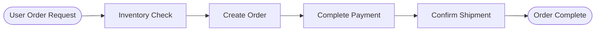
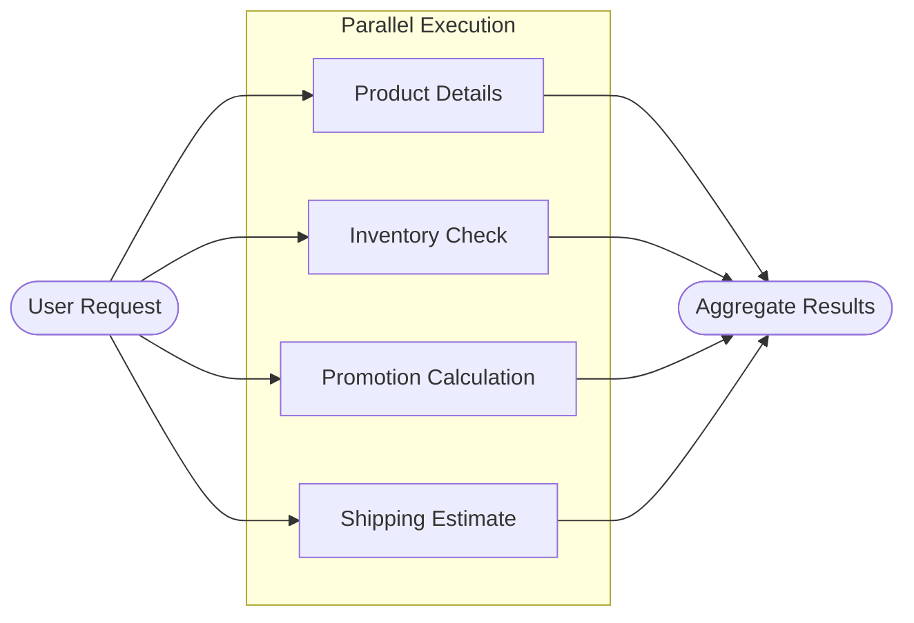

# Prebuilt State-Graph Construction Functions

## Overview

LangGraph is the official orchestration framework introduced by LangChain for building complex workflows. However, in real-world business scenarios, using LangGraph directly often requires writing a significant amount of boilerplate code (node naming, edge connection, graph compilation, etc.).

To lower the barrier to entry, this library provides two preset functions for quickly building state graphs with sequential or parallel execution patterns. Developers only need to focus on implementing the business logic for nodes, while the orchestration work is handled automatically by the functions.

The two functions are as follows:

| Function Name | Function Description | Applicable Scenarios |
|---------------|----------------------|----------------------|
| **create_sequential_graph** | Combines multiple nodes in sequence to form a sequential execution state graph | Tasks must be executed step-by-step and depend on the output of the previous step |
| **create_parallel_graph** | Combines multiple nodes in parallel to form a parallel execution state graph | Multiple tasks are independent of each other and can be executed simultaneously to improve efficiency |

## Sequential Workflow

Sequential workflows are suitable for scenarios where "tasks must be executed in steps, and the subsequent step depends on the output of the previous one." In LangGraph, each step usually corresponds to a state graph node.

You can use `create_sequential_graph` to combine multiple nodes into a state graph in a fixed order.

### Parameter Description

| Parameter | Description |
|-----------|-------------|
| `nodes` | A list of nodes to combine, which can be node functions or tuples consisting of a node name and a node function.<br><br>**Type**: `list[Node]`<br>**Required**: Yes |
| `state_schema` | The State Schema of the final generated graph.<br><br>**Type**: `StateT`<br>**Required**: Yes |
| `graph_name` | The name of the final generated graph.<br><br>**Type**: `str`<br>**Required**: No |
| `context_schema` | The Context Schema of the final generated graph.<br><br>**Type**: `ContextT`<br>**Required**: No |
| `input_schema` | The Input Schema of the final generated graph.<br><br>**Type**: `InputT`<br>**Required**: No |
| `output_schema` | The Output Schema of the final generated graph.<br><br>**Type**: `OutputT`<br>**Required**: No |
| `checkpointer` | The Checkpointer of the final generated graph.<br><br>**Type**: `Checkpointer`<br>**Required**: No |
| `store` | The Store of the final generated graph.<br><br>**Type**: `BaseStore`<br>**Required**: No |
| `cache` | The Cache of the final generated graph.<br><br>**Type**: `BaseCache`<br>**Required**: No |

### Typical Scenario

Taking a user purchasing a product as an example, the typical flow is as follows:



This process is tightly linked, and the sequence cannot be reversed.

These four stages (inventory check, create order, complete payment, confirm shipment) can be abstracted into independent nodes, with dedicated agents responsible for execution.
Using `create_sequential_graph` to connect these four nodes in sequence creates a highly automated product purchase workflow with clear responsibilities.

The following example shows how to use `create_sequential_graph` to build a sequential workflow for product purchasing.

First, create the chat model object. Here we use accessing the locally deployed `qwen3-4b` via vLLM as an example. Since its interface is compatible with OpenAI, we can directly use `create_openai_compatible_model` to construct the model class.

```python
from langchain_dev_utils.chat_models.adapters import create_openai_compatible_model

ChatVLLM = create_openai_compatible_model(
    model_provider="vllm",
    base_url="http://localhost:8000/v1",
    chat_model_cls_name="ChatVLLM",
)
```
Then instantiate a `ChatVLLM` object for subsequent agents to call.

```python
model = ChatVLLM(model="qwen3-4b")
```
Next, create the relevant tools, such as checking inventory, creating orders, processing payments, etc.

??? example "Reference for Tool Implementation"

    ```python
    from langchain_core.tools import tool

    @tool
    def check_inventory(product_name: str) -> dict:
        """Query inventory"""
        return {"product_name": product_name, "in_stock": True, "available": 42}

    @tool
    def create_order(product_name: str, quantity: int) -> str:
        """Create order"""
        return f"Order ORD-10001 created, Product: {product_name}, Quantity: {quantity}."

    @tool
    def pay_order(order_id: str) -> str:
        """Pay order"""
        return f"Order {order_id} paid successfully."

    @tool
    def confirm_delivery(order_id: str, address: str) -> str:
        """Confirm shipment"""
        return f"Order {order_id} arranged for shipment, Delivery address: {address}."
    ```

Then create the corresponding four sub-agents and the node functions that invoke these agents.

```python
from langchain.agents import create_agent

inventory_agent = create_agent(
    model=model,
    tools=[check_inventory],
    system_prompt="You are an inventory assistant responsible for confirming product availability. Finally, output the inventory query result.",
    name="inventory_agent",
    
)

order_agent = create_agent(
    model=model,
    tools=[create_order],
    system_prompt="You are an order assistant responsible for creating orders.",
    name="order_agent"
)

payment_agent = create_agent(
    model=model,
    tools=[pay_order],
    system_prompt="You are a payment assistant responsible for completing payments.",
    name="payment_agent"
)

delivery_agent = create_agent(
    model=model,
    tools=[confirm_delivery],
    system_prompt=(
        "You are a delivery assistant responsible for confirming shipment information and arranging delivery."
    ),
    name="delivery_agent",
    state_schema=AgentState
)

def inventory(state: AgentState):
    response = inventory_agent.invoke({"messages": state["messages"]})
    return {"messages": [AIMessage(content=response["messages"][-1].content)]}

def order(state: AgentState):
    response = order_agent.invoke({"messages": state["messages"]})
    return {"messages": [AIMessage(content=response["messages"][-1].content)]}
    
def payment(state: AgentState):
    response = payment_agent.invoke({"messages": state["messages"]})
    return {"messages": [AIMessage(content=response["messages"][-1].content)]}
    
def delivery(state: AgentState):
    response = delivery_agent.invoke({"messages": state["messages"]})
    return {"messages": [AIMessage(content=response["messages"][-1].content)]}
```

!!! info "Note"

    Although LangGraph allows adding agents (sub-graphs) directly as nodes to the graph, doing so causes the current agent's context to include the entire execution context of previous agents, which violates best practices for context engineering management. Therefore, it is recommended to wrap agents inside node functions and only output the final result.

Finally, use `create_sequential_graph` to connect these four nodes in sequence to form a state graph.

```python
from langchain_dev_utils.graph import create_sequential_graph

graph = create_sequential_graph(
    nodes=[
        inventory,
        order,
        payment,
        delivery,
    ],
    state_schema=AgentState
)
```
Running example:

```python
response = graph.invoke(
    {
        "messages": [
            HumanMessage("I want to buy a pair of wireless headphones, quantity 2. Please place the order. Delivery address is X City, X District, X Road, X No.")
        ]
    }
)
print(response)
```


## Parallel Workflow

Parallel workflows are suitable for scenarios where "multiple tasks are independent of each other and can be executed simultaneously," improving overall throughput or reducing end-to-end latency through concurrent execution.

You can use `create_parallel_graph` to combine multiple nodes into a state graph in a parallel fashion.

### Parameter Description

| Parameter | Description |
|-----------|-------------|
| `nodes` | A list of nodes to combine, which can be node functions or tuples consisting of a node name and a node function.<br><br>**Type**: `list[Node]`<br>**Required**: Yes |
| `state_schema` | The State Schema of the final generated graph.<br><br>**Type**: `StateT`<br>**Required**: Yes |
| `graph_name` | The name of the final generated graph.<br><br>**Type**: `str`<br>**Required**: No |
| `context_schema` | The Context Schema of the final generated graph.<br><br>**Type**: `ContextT`<br>**Required**: No |
| `input_schema` | The Input Schema of the final generated graph.<br><br>**Type**: `InputT`<br>**Required**: No |
| `output_schema` | The Output Schema of the final generated graph.<br><br>**Type**: `OutputT`<br>**Required**: No |
| `checkpointer` | The Checkpointer of the final generated graph.<br><br>**Type**: `Checkpointer`<br>**Required**: No |
| `store` | The Store of the final generated graph.<br><br>**Type**: `BaseStore`<br>**Required**: No |
| `cache` | The Cache of the final generated graph.<br><br>**Type**: `BaseCache`<br>**Required**: No |
| `branches_fn` | Parallel branch function that returns a list of Send objects to control parallel execution.<br><br>**Type**: `Callable`<br>**Required**: No |

### Typical Scenario

In the product purchasing scenario, users may need multiple queries simultaneously, such as product details, inventory, promotions, and shipping estimates, which can be executed in parallel.

The flow is as follows:



Next, we create a parallel workflow to implement the above process.

First, create a few tools.

??? example "Reference for Tool Implementation"

    ```python
    @tool
    def get_product_detail(product_name: str) -> dict:
        """Query product details"""
        return {
            "product_name": product_name,
            "sku": "SKU-10001",
            "price": 299,
            "highlights": ["Active Noise Cancellation", "Bluetooth 5.3", "30-hour battery life"],
        }

    @tool
    def check_inventory(product_name: str) -> dict:
        """Query inventory"""
        return {"product_name": product_name, "in_stock": True, "available": 42}

    @tool
    def calculate_promotions(product_name: str, quantity: int) -> dict:
        """Calculate promotions"""
        return {
            "product_name": product_name,
            "quantity": quantity,
            "discounts": ["30 off 300", "Member 5% off"],
            "estimated_discount": 45,
        }

    @tool
    def estimate_shipping(address: str) -> dict:
        """Estimate shipping fee and time"""
        return {
            "address": address,
            "fee": 12,
            "eta_days": 2,
        }
    ```

And the corresponding sub-agents:

```python
product_agent = create_agent(
    model,
    tools=[get_product_detail],
    system_prompt="You are a product assistant responsible for parsing user needs and querying product details.",
    name="product_agent",
    state_schema=AgentState,
)

inventory_agent = create_agent(
    model,
    tools=[check_inventory],
    system_prompt="You are an inventory assistant responsible for checking inventory based on SKU.",
    name="inventory_agent",
    state_schema=AgentState,
)

promotion_agent = create_agent(
    model,
    tools=[calculate_promotions],
    system_prompt="You are a promotion assistant responsible for calculating current available discounts and estimated discounts.",
    name="promotion_agent",
    state_schema=AgentState,
)

shipping_agent = create_agent(
    model,
    tools=[estimate_shipping],
    system_prompt="You are a shipping assistant responsible for estimating shipping fees and delivery time.",
    name="shipping_agent",
    state_schema=AgentState,
)

def product(state: AgentState):
    response = product_agent.invoke({"messages": state["messages"]})
    return {"messages": [AIMessage(content=response["messages"][-1].content)]}

def inventory(state: AgentState):
    response = inventory_agent.invoke({"messages": state["messages"]})
    return {"messages": [AIMessage(content=response["messages"][-1].content)]}

def promotion(state: AgentState):
    response = promotion_agent.invoke({"messages": state["messages"]})
    return {"messages": [AIMessage(content=response["messages"][-1].content)]}

def shipping(state: AgentState):
    response = shipping_agent.invoke({"messages": state["messages"]})
    return {"messages": [AIMessage(content=response["messages"][-1].content)]}
```

Use `create_parallel_graph` to complete the orchestration of the parallel state graph.

```python
from langchain_dev_utils.graph import create_parallel_graph

graph = create_parallel_graph(
    nodes=[
       product,
       inventory,
       promotion,
       shipping,
    ],
    state_schema=AgentState,
    graph_name="parallel_graph",
)
```
Running example:

```python
response = graph.invoke(
    {"messages": [HumanMessage("I want to buy a pair of wireless headphones, quantity 2. Delivery address: X City, X District, X Road, X No.")]}
)
print(response)
```


### On-demand Parallelism

In some cases, you may not want all nodes to participate in parallel execution, but instead prefer to "selectively run a subset of nodes in parallel based on conditions." This can be achieved by specifying a branch function via `branches_fn`.

The branch function needs to return a list of `Send` objects, where each `Send` contains the target node name and the input for that node.

#### Implementation of Router Multi-Agent Architecture

The `Router` is a typical architecture for multi-agent systems: a router model analyzes the user request and decomposes the task, then dispatches it to several business agents for execution. In the order query scenario, users may be concerned about order status, product information, or refunds simultaneously. The router model can distribute the request to order, product, and refund agents.

First, write the tools.

??? example "Reference for Tool Implementation"

    ```python
    @tool
    def list_orders() -> dict:
        """Query user order list"""
        return {
            "orders": [
                {
                    "order_id": "ORD-20250101-0001",
                    "status": "Shipped",
                    "items": [{"product_name": "Wireless Headphones", "qty": 1}],
                    "created_at": "2025-01-01 10:02:11",
                },
                {
                    "order_id": "ORD-20241215-0234",
                    "status": "Completed",
                    "items": [{"product_name": "Mechanical Keyboard", "qty": 1}],
                    "created_at": "2024-12-15 21:18:03",
                },
            ],
        }

    @tool
    def get_order_detail(order_id: str) -> dict:
        """Query order details"""
        return {
            "status": "Shipped",
            "receiver": {"name": "Zhang San", "phone": "138****0000"},
            "items": [
                {
                    "product_id": "P-10001",
                    "product_name": "Wireless Headphones",
                    "qty": 1,
                    "price": 299,
                }
            ],
        }

    @tool
    def get_shipping_trace(tracking_no: str) -> dict:
        """Query shipping tracking"""
        return {
            "events": [
                {"time": "2025-01-02 09:10", "status": "Package picked up"},
                {"time": "2025-01-02 18:45", "status": "In transit"},
                {"time": "2025-01-03 11:20", "status": "Arrived at delivery station"},
            ],
        }

    @tool
    def search_products(query: str) -> dict:
        """Search products"""
        return {
            "results": [
                {
                    "product_id": "P-10001",
                    "name": "Wireless Headphones Pro",
                    "price": 299,
                    "highlights": ["Noise Cancelling", "Bluetooth 5.3", "30h Battery"],
                },
                {
                    "product_id": "P-10002",
                    "name": "Wireless Headphones Lite",
                    "price": 199,
                    "highlights": ["Lightweight", "Low Latency", "24h Battery"],
                },
            ],
        }

    @tool
    def get_product_detail(product_id: str) -> dict:
        """Query product details"""
        return {
            "product_id": product_id,
            "name": "Wireless Headphones Pro",
            "price": 299,
            "specs": {"color": ["Black", "White"], "warranty_months": 12},
            "description": "True wireless headphones featuring noise cancellation and long battery life.",
        }


    @tool
    def check_inventory(product_name: str) -> dict:
        """Query inventory"""
        return {"product_name": product_name, "in_stock": True, "available": 42}

    @tool
    def create_refund(order_id: str, reason: str) -> dict:
        """Initiate refund"""
        return {
            "refund_id": "RFD-20250103-0009",
            "status": "Submitted",
            "reason": reason,
            "estimated_days": 3,
        }

    @tool
    def get_refund_status(refund_id: str) -> dict:
        """Query refund status"""
        return {
            "refund_id": refund_id,
            "status": "Processing",
            "progress": [
                {"time": "2025-01-03 12:05", "status": "Submitted"},
                {"time": "2025-01-03 12:20", "status": "Customer Service Review"},
            ],
            "estimated_days": 2,
        }

    @tool
    def refund_policy() -> dict:
        """View refund policy"""
        return {
            "window_days": 7,
            "requirements": ["Product in good condition", "Complete accessories", "Provide order number"],
            "notes": ["Some promotional items do not support no-reason refunds", "Arrival time depends on payment channel"],
        }
    ```

Then create the corresponding sub-agents.

```python
ORDER_AGENT_PROMPT = (
    "You are an order management assistant.\n"
    "You can use tools to query order lists, order details, and shipping tracking.\n"
    "Prioritize using tools to get information, then provide conclusions based on the tool results.\n"
    "Output Requirement: Answer in Chinese, structure clearly, and list order information in items if necessary.\n"
)

order_agent = create_agent(
    model,
    system_prompt=ORDER_AGENT_PROMPT,
    tools=[list_orders, get_order_detail, get_shipping_trace],
    name="order_agent",
)

PRODUCT_AGENT_PROMPT = (
    "You are a product management assistant.\n"
    "You can use tools to search products, view product details, and query inventory.\n"
    "Prioritize using tools to get information, then give suggestions based on the tool results.\n"
    "When the user's needs are unclear, ask a clarifying question first (e.g., category/budget/usage).\n"
    "Output Requirement: Answer in Chinese and give actionable next steps.\n"
)


product_agent = create_agent(
    model,
    system_prompt=PRODUCT_AGENT_PROMPT,
    tools=[search_products, get_product_detail, check_inventory],
    name="product_agent",
)

REFUND_AGENT_PROMPT = (
    "You are a refund management assistant.\n"
    "You can use tools to initiate refunds, query refund status, and view refund policy.\n"
    "Prioritize using tools to get information; if the user is missing key fields (e.g., order number), ask for it first.\n"
    "Output Requirement: Answer in Chinese, clearly stating refund progress/required materials/estimated time.\n"
)

refund_agent = create_agent(
    model,
    system_prompt=REFUND_AGENT_PROMPT,
    tools=[create_refund, get_refund_status, refund_policy],
    name="refund_agent",
)

def order(state: AgentState):
    response = order_agent.invoke({"messages": state["messages"]})
    return {"messages": [AIMessage(content=response["messages"][-1].content)]}

def product(state: AgentState):
    response = product_agent.invoke({"messages": state["messages"]})
    return {"messages": [AIMessage(content=response["messages"][-1].content)]}

def refund(state: AgentState):
    response = refund_agent.invoke({"messages": state["messages"]})
    return {"messages": [AIMessage(content=response["messages"][-1].content)]}
```

Next, write the branch function: the router model generates the names of the sub-agents to be executed based on the request, as well as the task description to be sent to that sub-agent.

```python
from typing import Literal, cast

from langchain_core.messages import SystemMessage
from langgraph.types import Send
from pydantic import BaseModel, Field
from typing_extensions import TypedDict


class RouterInput(TypedDict):
    query: str


class RouterState(AgentState):
    query: str


ROUTER_SYSTEM_PROMPT = (
    "You are a Router model, only responsible for splitting user questions and distributing them to appropriate business sub-agents.\n"
    "Available business domains are only: order (orders), product (products), refund (refunds).\n"
    "You must output a classifications list (used to call multiple sub-agents in parallel).\n"
    "Rules:\n"
    "1) source must be one of the three above;\n"
    "2) query must be a task description sent to that sub-agent that can be executed directly;\n"
    "3) If a user sentence involves multiple business domains at the same time (e.g., 'check order' + 'view product' + 'ask refund'), it must be split into multiple classifications for parallel execution;\n"
    "4) If unable to judge, prioritize choosing product and pass the question to it as is.\n"
    "Example A: User: 'Check ORD-1 shipping and see if this headset is in stock' -> Return 2 items: order(query shipping) + product(query inventory).\n"
    "Example B: User: 'I want to return ORD-1, how long for refund' -> Return 1 item: refund(initiate/query refund).\n"
    "Example C: User: 'I want to know the specs of this headset' -> Return 1 item: product(query details).\n"
)


class Classification(TypedDict):
    """A routing decision: which agent to call and with what query."""

    source: Literal["order", "refund", "product"]
    query: str


class ClassificationResult(BaseModel):
    """Result of classifying a user query into sub-problems for agents."""

    classifications: list[Classification] = Field(
        description="List of agents to call and their corresponding sub-problems"
    )


def branch_fn(state: RouterState) -> list[Send]:
    structured_llm = model.with_structured_output(ClassificationResult)

    query = state.get("messages")[-1].content
    classification_result = cast(
        ClassificationResult,
        structured_llm.invoke(
            [
                SystemMessage(ROUTER_SYSTEM_PROMPT),
                HumanMessage(query),
            ]
        ),
    )

    classifications = classification_result.classifications or []
    if not classifications:
        classifications = [{"source": "product", "query": query}]

    sends: list[Send] = []
    for res in classifications:
        source = res.get("source")
        if source not in {"order", "refund", "product"}:
            source = "product"
        sends.append(Send(f"{source}", {"messages": [HumanMessage(res.get("query"))]}))
    return sends
```
Finally, use `create_parallel_graph` to complete the orchestration of the parallel state graph and pass in the branch function.

```python
graph = create_parallel_graph(
    nodes=[
        order,
        refund,
        product,
    ],
    state_schema=AgentState,
    graph_name="parallel_graph",
    branches_fn=branch_fn,
)
```

Running example:

```python
response = graph.invoke(
    {
        "messages": [HumanMessage("Hello, I want to check the product I purchased before")],
    }
)
print(response)

response = graph.invoke(
    {
        "messages": [HumanMessage("Recommend a pair of wireless headphones suitable for commuting and check stock; also, tell me your product refund policy?")],
    }
)
print(response)
```


!!! tip "Tip"

    - **When `branches_fn` parameter is NOT passed**: All nodes will be executed in parallel.
    - **When `branches_fn` parameter IS passed**: Which nodes are executed is determined by the return value of that function.