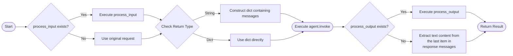

# Sub-Agent Tools (Agent as Tool)

## Overview

When building complex AI applications, multi-agent collaboration is a powerful architectural pattern. By assigning different responsibilities to specialized agents, you can achieve professional division of labor and efficient collaboration.

There are multiple ways to implement multi-agent collaboration, and **tool calling** is a common and flexible approach. By encapsulating subagents as tools, a primary agent can dynamically delegate tasks to specialized subagents based on requirements.

This library provides two pre-built functions to simplify this implementation:

| Function Name | Functional Description |
|---------------|------------------------|
| `wrap_agent_as_tool` | Wraps a single agent instance into an independent tool |
| `wrap_all_agents_as_tool` | Wraps multiple agent instances into a unified tool, specifying which subagent to call via parameters |

## Wrapping a Single Agent as a Tool

Wrapping a single agent requires just three steps:

1. Import `wrap_agent_as_tool`
2. Pass the agent instance as a parameter
3. Obtain a tool object that can be directly called by other agents

### Usage Example

Below, we use a `supervisor` agent to demonstrate how to wrap subagents as tools using `wrap_agent_as_tool`.

First, implement two subagents: one for sending emails and one for calendar queries and scheduling.

First, the implementation of the email agent:

```python
from langchain_core.tools import tool
from langchain_dev_utils.chat_models import register_model_provider
from langchain_dev_utils.agents import create_agent, wrap_agent_as_tool 

register_model_provider(
    "vllm",
    "openai-compatible",
    base_url="http://localhost:8000/v1",
)


@tool
def send_email(
    to: list[str],  # Email addresses
    subject: str,
    body: str,
    cc: list[str] = [],
) -> str:
    """Sends an email via the Email API. Requires correctly formatted addresses."""
    # Stub: In a real application, this would call SendGrid, Gmail API, etc.
    return f"Email sent to {', '.join(to)} - Subject: {subject}"


EMAIL_AGENT_PROMPT = (
    "You are an email assistant."
    "Draft professional emails based on natural language requests."
    "Extract recipient information and create appropriate subject lines and body content."
    "Use send_email to send the email."
    "Always confirm what was sent in your final reply."
)

email_agent = create_agent(
    "vllm:qwen3-4b",
    tools=[send_email],
    system_prompt=EMAIL_AGENT_PROMPT,
    name="email_agent",
)
```

And the implementation of the daily calendar agent:

```python
@tool
def create_calendar_event(
    title: str,
    start_time: str,  # ISO format: "2024-01-15T14:00:00"
    end_time: str,  # ISO format: "2024-01-15T15:00:00"
    attendees: list[str],  # Email addresses
    location: str = "",
) -> str:
    """Creates a calendar event. Requires precise ISO date-time format."""
    # Stub: In a real application, this would call Google Calendar API, Outlook API, etc.
    return f"Event created: {title} from {start_time} to {end_time} with {len(attendees)} participants"


@tool
def get_available_time_slots(
    attendees: list[str],
    date: str,  # ISO format: "2024-01-15"
    duration_minutes: int,
) -> list[str]:
    """Queries calendar availability for attendees on a specific date."""
    # Stub: In a real application, this would query a calendar API
    return ["09:00", "14:00", "16:00"]


CALENDAR_AGENT_PROMPT = (
    "You are a calendar scheduling assistant."
    "Parse natural language scheduling requests (e.g., 'next Tuesday afternoon at 2pm') into the correct ISO date-time format."
    "Use get_available_time_slots to check availability when needed."
    "Use create_calendar_event to schedule the event."
    "Always confirm what was scheduled in your final reply."
)

calendar_agent = create_agent(
    "vllm:qwen3-4b",
    tools=[create_calendar_event, get_available_time_slots],
    system_prompt=CALENDAR_AGENT_PROMPT,
    name="calendar_agent",
)
```

Next, use `wrap_agent_as_tool` to wrap these two subagents as tools.

```python
schedule_event = wrap_agent_as_tool(
    calendar_agent,
    tool_name="schedule_event",
    tool_description=(
        "Schedule calendar events using natural language."
        "Use this when the user wants to create, modify, or check calendar appointments."
        "Capable of handling date/time parsing, checking available times, and creating events."
        "Input: Natural language calendar request (e.g., 'meeting with design team next Tuesday at 2pm')"
    ),
)
manage_email = wrap_agent_as_tool(
    email_agent,
    tool_name="manage_email",
    tool_description=(
        "Send emails using natural language."
        "Use this when the user wants to send notifications, reminders, or any email communication."
        "Capable of extracting recipient information, subject generation, and email drafting."
        "Input: Natural language email request (e.g., 'send them a meeting reminder')"
    ),
)
```

!!! note "Note"
    Both `tool_name` and `tool_description` for `wrap_agent_as_tool` are optional parameters. If omitted, the tool name defaults to `transfer_to_{agent_name}`, and the description defaults to `This tool transforms input to {agent_name}`.  
    To allow the primary agent to identify and invoke the subagent more accurately, it is recommended to explicitly specify these two items (especially the description) to clearly convey the responsibilities and capabilities of the subagent.


Finally, create a `supervisor_agent` that can call these two tools.

```python
SUPERVISOR_PROMPT = (
    "You are a helpful personal assistant."
    "You can schedule calendar events and send emails."
    "Break down user requests into appropriate tool calls and coordinate the results."
    "When a request involves multiple operations, please use multiple tools sequentially."
)


supervisor_agent = create_agent(
    "vllm:qwen3-4b",
    tools=[schedule_event, manage_email],
    system_prompt=SUPERVISOR_PROMPT,
)

print(
    supervisor_agent.invoke({"messages": [HumanMessage(content="查询明天的空闲时间")]})
)
print(
    supervisor_agent.invoke(
        {"messages": [HumanMessage(content="给test@123.com发送邮件会议提醒")]}
    )
)
```


!!! info "Info"

    In the example above, we imported `create_agent` from `langchain_dev_utils.agents` instead of `langchain.agents`. This is because this library provides a function with the exact same functionality as the official `create_agent`, but with the added feature of specifying the model via a string. This allows you to directly use models registered via `register_model_provider` without needing to initialize a model instance first.


## Wrapping Multiple Agents as a Single Tool

Wrapping multiple agents into a single tool requires just three steps:

1. Import `wrap_all_agents_as_tool`
2. Pass multiple agent instances as a list at once
3. Obtain a unified tool object that can be directly called by other agents


### Usage Example

For the `calendar_agent` and `email_agent` from the previous example, we can wrap them into a single tool `call_subagent`:

```python
call_subagent_tool = wrap_all_agents_as_tool(
    [calendar_agent, email_agent],
    tool_name="call_subagent",
    tool_description=(
        "Call subagents to execute tasks."
        "Available agents are:"
        "- calendar_agent: for scheduling calendar events"
        "- email_agent: for sending emails"
    ),
)

MAIN_AGENT_PROMPT = (
    "You are a helpful personal assistant."
    "You can use the **call_subagent** tool to invoke subagents to perform tasks."
    "Break down user requests into appropriate tool calls and coordinate the results."
    "When a request involves multiple operations, please use multiple tools sequentially."
)

main_agent = create_agent(
    "vllm:qwen3-4b",
    tools=[call_subagent_tool],
    system_prompt=MAIN_AGENT_PROMPT,
)
```

!!! note "Note"

    Both `tool_name` and `tool_description` for `wrap_all_agents_as_tool` are optional parameters. If omitted, the tool name defaults to `task`, and the description defaults to `Launch an ephemeral subagent for a task.\nAvailable agents:\n {available_agents}`.  
    To ensure the primary agent accurately identifies and calls the subagent, it is recommended to explicitly fill in these two items, especially the description, to clearly convey the responsibilities and capabilities of each subagent.


!!! info "Info"

    Besides using the `wrap_all_agents_as_tool` provided by this library to wrap multiple agents into a single tool, you can also use the `SubAgentMiddleware` provided by the `deepagents` library to achieve a similar effect.

## Hook Function Mechanism

This library includes a flexible hook mechanism that allows you to insert custom logic before and after subagent execution. This mechanism applies to both `wrap_agent_as_tool` and `wrap_all_agents_as_tool`. The following explanation uses `wrap_agent_as_tool` as an example.

The flow of hook function execution is shown in the diagram below:


### 1. pre_input_hooks

Preprocess the input before the agent runs. Useful for input enhancement, context injection, format validation, permission checks, etc.

#### Supported Input Types

| Type | Description |
|------|-------------|
| Single sync function | Used for both synchronous (`invoke`) and asynchronous (`ainvoke`) call paths (will not be awaited in async path, called directly) |
| Tuple `(sync_func, async_func)` | The first function is for the synchronous call path; the second function (must be `async def`) is for the asynchronous call path and will be awaited |

#### Function Signature

```python
def pre_input_hook(request: str, runtime: ToolRuntime) -> str | dict[str, Any]:
    """
    Args:
        request: Original tool call input
        runtime: langchain's ToolRuntime

    Returns:
        Processed input, serving as the actual input for the agent (needs to be str or dict)
    """
```

**Note**:

- The return value of the hook function must be str or dict, otherwise a ValueError will be raised.

- If a dict is returned, it will be used directly as the agent's actual input.

- If a str is returned, it will be wrapped as `HumanMessage(content=...)`, ultimately serving as the agent's actual input in the format `{"messages": [HumanMessage(content=...)]}`.

- If `pre_input_hooks` is not provided, the original input is used directly as the agent's actual input in the format `{"messages": [HumanMessage(content=request)]}`.

#### Usage Example

For example, passing additional session context to the SubAgent to provide more precise task context.

```python
from langchain.tools import ToolRuntime
from langchain_dev_utils.agents import wrap_agent_as_tool


def process_input(request: str, runtime: ToolRuntime) -> str:
    original_user_message = next(
        message for message in runtime.state["messages"] if message.type == "human"
    )
    prompt = (
        "You are assisting with the following user inquiry:\n\n"
        f"{original_user_message.text}\n\n"
        "You have been assigned the following sub-task:\n\n"
        f"{request}"
    )
    return prompt


# Usage
call_agent_tool = wrap_agent_as_tool(agent, pre_input_hooks=process_input)
```


### 2. post_output_hooks

Post-process the complete message list returned by the agent after execution to generate the tool's final return value. Useful for result extraction, structured transformation, etc.

#### Supported Input Types

| Type | Description |
|------|-------------|
| Single function | Used for both synchronous and asynchronous paths (will not be awaited in async path) |
| Tuple `(sync_func, async_func)` | The first is for the synchronous path; the second (`async def`) is for the asynchronous path and will be awaited |

#### Function Signature

```python
def post_output_hook(request: str, response: dict[str, Any], runtime: ToolRuntime) -> Union[str, Command]:
    """
    Args:
        request: Unprocessed original input
        response: Complete response returned by the agent
        runtime: langchain's ToolRuntime
    
    Returns:
        A value that can be serialized to a string, or a Command object
    """
```

**Note**:

- The return value of the hook function must be a value that can be serialized to a string or a `Command` object.

- The hook function takes two arguments: `request` is the unprocessed original input, and `response` is the complete response returned by the agent (i.e., the return value of `agent.invoke(input)`).

- If `post_output_hooks` is not provided, the agent's final response will be used directly as the tool's return value (i.e., `response["messages"][-1].text`).

#### Usage Example

For example, adding extra return content for the primary agent.

```python
import json

def process_output(request: str, response: dict[str, Any], runtime: ToolRuntime) -> str:

    return json.dumps(
        {
            "status": "success",
            "event_id": "evt_123",
            "summary": response["messages"][-1].text,
        }
    )


# Usage
call_agent_tool = wrap_agent_as_tool(agent, post_output_hooks=process_output)
```

!!! tip "Tip"
    For the `wrap_all_agents_as_tool` function, if you need to customize `pre_input_hooks` or `post_output_hooks` for different subagents, you can call `get_subagent_name(runtime)` inside the hook to get the current agent name and then process them separately by name.
    For example, assume you only need to customize `pre_input_hooks` for the `weather_agent` subagent (e.g., adding the current city and time). You can implement it like this:

    ```python
    from langchain_dev_utils.agents.wrap import get_subagent_name
    from datetime import datetime
    
    def process_input(request: str, runtime: ToolRuntime):
        subagent_name = get_subagent_name(runtime)
        if subagent_name == "weather_agent":
            city = runtime.state.get("city", "Unknown City")
            time = datetime.now().strftime("%Y-%m-%d %H:%M:%S")
            return f"Current city is: {city}, time is: {time}. Please complete the task based on the above information." + request 
        return request
    ```