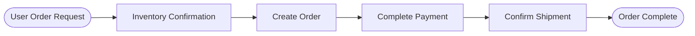
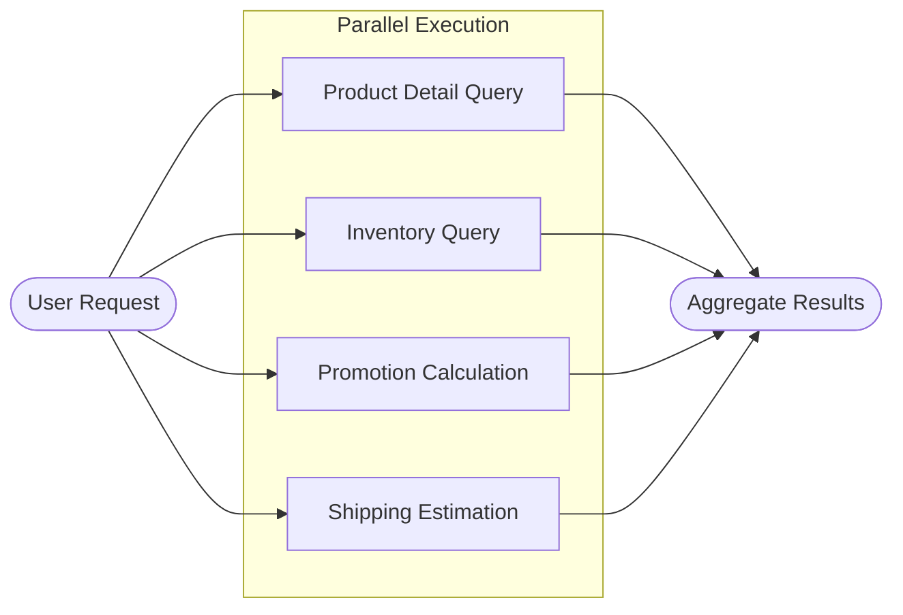

# State Graph Orchestration

## Overview

In LangGraph, state graph orchestration is a key capability for building complex AI applications. By combining multiple state graphs in specific patterns, you can form powerful and logically clear workflows.

This library provides two of the most common orchestration methods:

| Orchestration Method | Functional Description | Applicable Scenarios |
|---------------------|-----------------------|---------------------|
| **Sequential Orchestration** | Combines multiple state graphs in sequence to form a sequential workflow | Tasks need to be executed step-by-step and depend on the output of the previous step |
| **Parallel Orchestration** | Combines multiple state graphs in parallel to form a parallel workflow | Multiple tasks are independent of each other and can be executed simultaneously to improve efficiency |

## Sequential Orchestration

Sequential Orchestration (Sequential Pipeline) breaks down complex tasks into continuous, ordered sub-tasks and assigns them to different specialized agents to process in turn.

Use `create_sequential_pipeline` to combine multiple state graphs in a sequential manner.

### Typical Application Scenarios

Taking a user purchasing a product as an example, the typical process is as follows:



This process is interlinked and the order cannot be reversed.

The four steps—Inventory Confirmation, Create Order, Complete Payment, and Confirm Shipment—are handled by specialized agents respectively. By orchestrating these four state graphs sequentially using `create_sequential_pipeline`, you can form a highly automated and clearly defined product purchasing workflow.

### Basic Example

The following example shows how to build a product purchasing sequential workflow using `create_sequential_pipeline`:

First, create the chat model object. Here, we use `qwen3-4b` deployed locally via vllm as an example. Since its interface is compatible with OpenAI, we can directly use `create_openai_compatible_model` to construct the model class.

```python
from langchain_dev_utils.chat_models.adapters import create_openai_compatible_model

ChatVLLM = create_openai_compatible_model(
    model_provider="vllm",
    base_url="http://localhost:8000/v1",
    chat_model_cls_name="ChatVLLM",
)
```
Then instantiate a `ChatVLLM` object for subsequent agents to call.

```python
model = ChatVLLM(model="qwen3-4b")
```
Next, create the relevant tools, such as checking inventory, creating orders, making payments, etc.

??? example "Reference for tool implementation"

    ```python
    from langchain_core.tools import tool

    @tool
    def check_inventory(product_name: str) -> dict:
        """Check inventory"""
        return {"product_name": product_name, "in_stock": True, "available": 42}

    @tool
    def create_order(product_name: str, quantity: int) -> str:
        """Create an order"""
        return f"Order ORD-10001 created, product: {product_name}, quantity: {quantity}."

    @tool
    def pay_order(order_id: str) -> str:
        """Pay for the order"""
        return f"Order {order_id} paid successfully."

    @tool
    def confirm_delivery(order_id: str, address: str) -> str:
        """Confirm shipment"""
        return f"Order {order_id} arranged for shipment, shipping address: {address}."
    ```

Then create the corresponding four sub-agents.

```python
from langchain.agents import create_agent

inventory_agent = create_agent(
    model=model,
    tools=[check_inventory],
    system_prompt="You are an inventory assistant responsible for confirming if the product is in stock.",
    name="inventory_agent",
)

order_agent = create_agent(
    model=model,
    tools=[create_order],
    system_prompt="You are an order assistant responsible for creating orders.",
    name="order_agent",
)

payment_agent = create_agent(
    model=model,
    tools=[pay_order],
    system_prompt="You are a payment assistant responsible for completing payments.",
    name="payment_agent",
)

delivery_agent = create_agent(
    model=model,
    tools=[confirm_delivery],
    system_prompt="You are a delivery assistant responsible for confirming shipment information.",
    name="delivery_agent",
)
```

Finally, use `create_sequential_pipeline` to orchestrate these four agents in sequence.

```python
from langchain_dev_utils.pipeline import create_sequential_pipeline
from langchain.agents import AgentState

graph = create_sequential_pipeline(
    sub_graphs=[
        inventory_agent,
        order_agent,
        payment_agent,
        delivery_agent,
    ],
    state_schema=AgentState,
)
```
Run the test:

```python
response = graph.invoke(
    {
        "messages": [
            HumanMessage("I want to buy a pair of wireless headphones, quantity 2, please place the order, shipping address: X District, X Road, X City")
        ]
    }
)
print(response)
```

### Context Engineering Optimization

This example passes the complete context of all previous agents to the current agent in sequence, which may cause context bloat and affect performance and effectiveness.

The following solutions can be used to streamline the context:

| Solution | Description | Pros |
|----------|-------------|------|
| **Use Middleware** | Use `create_agent` with middleware to extract and pass only necessary information | Simple to implement, minimal code changes |
| **Custom State Graph** | Build a custom state graph based on `LangGraph`, explicitly controlling state fields and message flow | High flexibility, precise control |

??? example "Click to view reference code for solving via middleware"

    ```python
    from typing import Any

    from langchain.agents.middleware import AgentMiddleware
    from langchain_core.messages import RemoveMessage
    from langgraph.runtime import Runtime

    from langchain_dev_utils.agents.middleware import format_prompt


    class PurchaseState(AgentState, total=False):
        stock: str
        order: str
        payment: str
        delivery: str


    class ClearAgentContextMiddleware(AgentMiddleware):
        state_schema = PurchaseState

        def __init__(self, result_save_key: str) -> None:
            super().__init__()
            self.result_save_key = result_save_key

        def after_agent(
            self, state: PurchaseState, runtime: Runtime
        ) -> dict[str, Any] | None:
            final_message = state["messages"][-1]
            update_key = self.result_save_key
            return {
                "messages": [
                    RemoveMessage(id=msg.id or "") for msg in state["messages"][1:]
                ],
                update_key: final_message.content,
            }


    inventory_agent = create_agent(
        model=model,
        tools=[check_inventory],
        system_prompt="You are an inventory assistant responsible for confirming if the product is in stock. Please output the inventory check result.",
        name="inventory_agent",
        state_schema=PurchaseState,
        middleware=[format_prompt, ClearAgentContextMiddleware("stock")],
    )

    order_agent = create_agent(
        model=model,
        tools=[create_order],
        system_prompt=(
            "You are an order assistant responsible for creating orders.\n"
            "Inventory result: {stock}\n"
            "Please create an order based on the inventory result and output the order number."
        ),
        name="order_agent",
        state_schema=PurchaseState,
        middleware=[format_prompt, ClearAgentContextMiddleware("order")],
    )

    payment_agent = create_agent(
        model=model,
        tools=[pay_order],
        system_prompt=(
            "You are a payment assistant responsible for completing payments.\n"
            "Order result: {order}\n"
            "Please retrieve the order number from the order result and complete the payment."
        ),
        name="payment_agent",
        state_schema=PurchaseState,
        middleware=[format_prompt, ClearAgentContextMiddleware("payment")],
    )

    delivery_agent = create_agent(
        model=model,
        tools=[confirm_delivery],
        system_prompt=(
            "You are a delivery assistant responsible for confirming shipment information.\n"
            "Order result: {order}\n"
            "Payment result: {payment}\n"
            "Please confirm shipment and repeat the shipping address."
        ),
        name="delivery_agent",
        state_schema=PurchaseState,
        middleware=[format_prompt, ClearAgentContextMiddleware("delivery")],
    )

    graph = create_sequential_pipeline(
        sub_graphs=[
            inventory_agent,
            order_agent,
            payment_agent,
            delivery_agent,
        ],
        state_schema=PurchaseState,
    )

    response = graph.invoke(
        {
            "messages": [
                HumanMessage("I want to buy a pair of wireless headphones, quantity 2, please place the order, shipping address: X District, X Road, X City")
            ]
        }
    )
    print(response)
    ```

    **Implementation Notes**:

    1. **Extend State Schema**: Add four fields—`stock`, `order`, `payment`, `delivery`—to the agent's State Schema to store the final output of each agent.

    2. **Custom Middleware**: Create the `ClearAgentContextMiddleware` middleware. After each agent finishes, it uses `RemoveMessage` to clear the context and then writes the final result (`final_message.content`) to the corresponding field.

    3. **Dynamic Prompt Formatting**: Use the `format_prompt` middleware to stitch previous outputs into the `system_prompt` at runtime as needed.


!!! info "Hint"

    For sequentially combined graphs, LangGraph's `StateGraph` provides `add_sequence` as a shorthand, which is more suitable for scenarios where nodes are functions (rather than sub-graphs).

    ```python
    graph = StateGraph(AgentState)
    graph.add_sequence([("graph1", graph1), ("graph2", graph2), ("graph3", graph3)])
    graph.add_edge("__start__", "graph1")
    graph = graph.compile()
    ```

    However, the above method is still somewhat cumbersome. It is recommended to use `create_sequential_pipeline`, which allows you to quickly build a sequentially executing graph with a single line of code.

## Parallel Orchestration

Parallel Orchestration (Parallel Pipeline) combines multiple state graphs in parallel, executing tasks concurrently to improve efficiency.

Use `create_parallel_pipeline` to combine multiple state graphs in a parallel manner to achieve parallel execution.

### Typical Application Scenarios

In a product purchasing scenario, a user might need multiple queries simultaneously, such as product details, inventory, promotions, and shipping cost estimation, which can be executed in parallel.

The process is as follows:




### Basic Example

First, create a few tools.

??? example "Reference for tool implementation"

    ```python
    @tool
    def get_product_detail(product_name: str) -> dict:
        """Query product details"""
        return {
            "product_name": product_name,
            "sku": "SKU-10001",
            "price": 299,
            "highlights": ["Active Noise Cancellation", "Bluetooth 5.3", "30-hour Battery"],
        }

    @tool
    def check_inventory(product_name: str) -> dict:
        """Query inventory"""
        return {"product_name": product_name, "in_stock": True, "available": 42}

    @tool
    def calculate_promotions(product_name: str, quantity: int) -> dict:
        """Calculate promotions"""
        return {
            "product_name": product_name,
            "quantity": quantity,
            "discounts": ["30 off 300", "Member 5% off"],
            "estimated_discount": 45,
        }

    @tool
    def estimate_shipping(address: str) -> dict:
        """Estimate shipping cost and time"""
        return {
            "address": address,
            "fee": 12,
            "eta_days": 2,
        }
    ```

And the corresponding sub-agents:

```python
product_agent = create_agent(
    model,
    tools=[get_product_detail],
    system_prompt="You are a product assistant responsible for parsing user needs and querying product details.",
    name="product_agent",
    state_schema=AgentState,
)

inventory_agent = create_agent(
    model,
    tools=[check_inventory],
    system_prompt="You are an inventory assistant responsible for checking inventory based on SKU.",
    name="inventory_agent",
    state_schema=AgentState,
)

promotion_agent = create_agent(
    model,
    tools=[calculate_promotions],
    system_prompt="You are a promotion assistant responsible for calculating current available promotions and estimated discounts.",
    name="promotion_agent",
    state_schema=AgentState,
)

shipping_agent = create_agent(
    model,
    tools=[estimate_shipping],
    system_prompt="You are a delivery assistant responsible for estimating shipping costs and time.",
    name="shipping_agent",
    state_schema=AgentState,
)
```

Combine the sub-agents using `create_parallel_pipeline`.

```python
from langchain_dev_utils.pipeline import create_parallel_pipeline

graph = create_parallel_pipeline(
    sub_graphs=[
        product_agent,
        inventory_agent,
        promotion_agent,
        shipping_agent,
    ],
    state_schema=AgentState,
)
```
Run the test:

```python
response = graph.invoke(
    {"messages": [HumanMessage("I want to buy a pair of wireless headphones, quantity 2, shipping address: X District, X Road, X City")]}
)
print(response)
```


### Using Branch Functions to Specify Sub-graphs for Parallel Execution

In most scenarios, you may not want all sub-graphs to execute in parallel, but rather execute a subset conditionally. In this case, you need to use `branches_fn` to specify a branch function. The branch function must return a list of `Send`, where each `Send` contains the sub-graph name and the input.

#### Application Scenarios

`Router` is a typical architecture for multi-agent systems: a routing model analyzes user requests and decomposes tasks, then distributes them to several business agents for execution. In an order query scenario, users might care about order status, product information, or refunds simultaneously. The routing model can assign requests to order, product, or refund agents accordingly.

First, write the tools.

??? example "Reference for tool implementation"

    ```python
    @tool
    def list_orders() -> dict:
        """Query user order list"""
        return {
            "orders": [
                {
                    "order_id": "ORD-20250101-0001",
                    "status": "Shipped",
                    "items": [{"product_name": "Wireless Headphones", "qty": 1}],
                    "created_at": "2025-01-01 10:02:11",
                },
                {
                    "order_id": "ORD-20241215-0234",
                    "status": "Completed",
                    "items": [{"product_name": "Mechanical Keyboard", "qty": 1}],
                    "created_at": "2024-12-15 21:18:03",
                },
            ],
        }

    @tool
    def get_order_detail(order_id: str) -> dict:
        """Query order details"""
        return {
            "status": "Shipped",
            "receiver": {"name": "Zhang San", "phone": "138****0000"},
            "items": [
                {
                    "product_id": "P-10001",
                    "product_name": "Wireless Headphones",
                    "qty": 1,
                    "price": 299,
                }
            ],
        }

    @tool
    def get_shipping_trace(tracking_no: str) -> dict:
        """Query shipping trajectory"""
        return {
            "events": [
                {"time": "2025-01-02 09:10", "status": "Package Picked Up"},
                {"time": "2025-01-02 18:45", "status": "In Transit"},
                {"time": "2025-01-03 11:20", "status": "Arrived at Delivery Station"},
            ],
        }

    @tool
    def search_products(query: str) -> dict:
        """Search products"""
        return {
            "results": [
                {
                    "product_id": "P-10001",
                    "name": "Wireless Headphones Pro",
                    "price": 299,
                    "highlights": ["ANC", "Bluetooth 5.3", "30h Battery"],
                },
                {
                    "product_id": "P-10002",
                    "name": "Wireless Headphones Lite",
                    "price": 199,
                    "highlights": ["Lightweight", "Low Latency", "24h Battery"],
                },
            ],
        }

    @tool
    def get_product_detail(product_id: str) -> dict:
        """Query product details"""
        return {
            "product_id": product_id,
            "name": "Wireless Headphones Pro",
            "price": 299,
            "specs": {"color": ["Black", "White"], "warranty_months": 12},
            "description": "True wireless headphones featuring noise cancellation and long battery life.",
        }


    @tool
    def check_inventory(product_name: str) -> dict:
        """Query inventory"""
        return {"product_name": product_name, "in_stock": True, "available": 42}

    @tool
    def create_refund(order_id: str, reason: str) -> dict:
        """Initiate refund"""
        return {
            "refund_id": "RFD-20250103-0009",
            "status": "Submitted",
            "reason": reason,
            "estimated_days": 3,
        }

    @tool
    def get_refund_status(refund_id: str) -> dict:
        """Query refund status"""
        return {
            "refund_id": refund_id,
            "status": "Processing",
            "progress": [
                {"time": "2025-01-03 12:05", "status": "Submitted"},
                {"time": "2025-01-03 12:20", "status": "CS Reviewing"},
            ],
            "estimated_days": 2,
        }

    @tool
    def refund_policy() -> dict:
        """View refund policy"""
        return {
            "window_days": 7,
            "requirements": ["Product in good condition", "Accessories complete", "Provide order number"],
            "notes": ["Some promotional items do not support no-reason refunds", "Refund time depends on payment channel"],
        }
    ```

Then create the corresponding sub-agents.

```python
ORDER_AGENT_PROMPT = (
    "You are an order management assistant.\n"
    "You can use tools to query order lists, order details, and shipping trajectories.\n"
    "Prioritize using tools to get information, then draw conclusions based on tool results.\n"
    "Output requirements: Answer in Chinese, clear structure, list order information in bullet points if necessary.\n"
)

order_agent = create_agent(
    model,
    system_prompt=ORDER_AGENT_PROMPT,
    tools=[list_orders, get_order_detail, get_shipping_trace],
    name="order_agent",
)


PRODUCT_AGENT_PROMPT = (
    "You are a product management assistant.\n"
    "You can use tools to search products, view product details, and check inventory.\n"
    "Prioritize using tools to get information, then provide suggestions based on tool results.\n"
    "When user needs are unclear, ask a clarifying question first (e.g., category/budget/usage).\n"
    "Output requirements: Answer in Chinese, give actionable next steps.\n"
)


product_agent = create_agent(
    model,
    system_prompt=PRODUCT_AGENT_PROMPT,
    tools=[search_products, get_product_detail, check_inventory],
    name="product_agent",
)


REFUND_AGENT_PROMPT = (
    "You are a refund management assistant.\n"
    "You can use tools to initiate refunds, query refund status, and view refund policies.\n"
    "Prioritize using tools to get information; if the user is missing key fields (e.g., order number), ask for it first.\n"
    "Output requirements: Answer in Chinese, clearly state refund progress/required materials/estimated time.\n"
)


refund_agent = create_agent(
    model,
    system_prompt=REFUND_AGENT_PROMPT,
    tools=[create_refund, get_refund_status, refund_policy],
    name="refund_agent",
)
```

Next, write the branch function: The routing model returns the name of the agent to execute and the corresponding task description based on the request.

```python
from typing import Literal, cast
from typing_extensions import TypedDict


from langchain_core.messages import SystemMessage
from langgraph.types import Send
from pydantic import BaseModel, Field


class RouterInput(TypedDict):
    query: str


class RouterState(AgentState):
    query: str


ROUTER_SYSTEM_PROMPT = (
    "You are a Router model, only responsible for splitting user questions and distributing them to appropriate business sub-agents.\n"
    "Available business domains are only: order (orders), product (products), refund (refunds).\n"
    "You must output a classifications list (used to call multiple sub-agents in parallel).\n"
    "Rules:\n"
    "1) source must be one of the three above;\n"
    "2) query must be a task description for that sub-agent that can be directly executed;\n"
    "3) If one sentence from the user involves multiple business domains (e.g., 'check order' + 'see product' + 'ask refund'), it must be split into multiple classifications for parallel execution;\n"
    "4) If unable to judge, prioritize product and pass the question to it as is.\n"
    "Example A: User: 'Check logistics for ORD-1 and see if these headphones are in stock' -> Return 2: order(check logistics)+product(check inventory).\n"
    "Example B: User: 'I want to return ORD-1, how long for refund' -> Return 1: refund(initiate/query refund).\n"
    "Example C: User: 'I want to know the specs of this headphone' -> Return 1: product(query details).\n"
)


class Classification(TypedDict):
    """A routing decision: which agent to call and with what query."""

    source: Literal["order", "refund", "product"]
    query: str


class ClassificationResult(BaseModel):
    """Result of classifying a user query into agent-oriented sub-questions."""

    classifications: list[Classification] = Field(
        description="List of agents to call and their corresponding sub-questions"
    )


def branch_fn(state: RouterState) -> list[Send]:
    structured_llm = model.with_structured_output(ClassificationResult)

    query = state.get("query")
    classification_result = cast(
        ClassificationResult,
        structured_llm.invoke(
            [
                SystemMessage(ROUTER_SYSTEM_PROMPT),
                HumanMessage(query),
            ]
        ),
    )

    classifications = classification_result.classifications or []
    if not classifications:
        classifications = [{"source": "product", "query": query}]

    sends: list[Send] = []
    for res in classifications:
        source = res.get("source")
        if source not in {"order", "refund", "product"}:
            source = "product"
        sub_query = (res.get("query") or query).strip() or query
        sends.append(Send(f"{source}_agent", {"messages": [HumanMessage(sub_query)]}))
    return sends
```

Finally, use `create_parallel_agent` to create the parallel agent and pass in the branch function.


Run the test:

```python
response_single = graph.invoke(
    {
        "query": "Hello, I want to check the products I purchased before",
    }
)
print(response_single)

response_parallel = graph.invoke(
    {
        "query": "Recommend a wireless headset suitable for commuting and check stock; also, tell me your product refund policy?",
    }
)
print(response_parallel)
```


!!! tip "Tip"

    - **When `branches_fn` is NOT passed**: All sub-graphs will be executed in parallel
    - **When `branches_fn` IS passed**: Which sub-graphs are executed is determined by the return value of that function