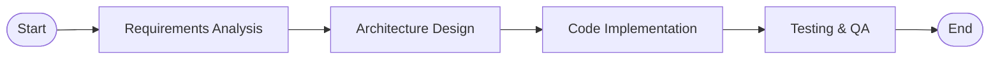
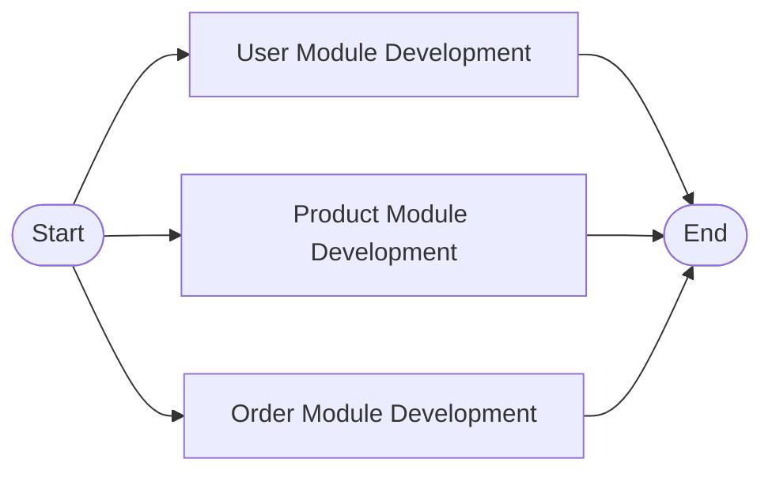

# State Graph Orchestration

## Overview

In LangGraph, state graph orchestration is a key technology for building complex AI applications. By combining multiple state graphs according to specific patterns, you can create powerful workflows with clear logic.

This library provides the following two orchestration methods:

| Orchestration Method | Function Description | Applicable Scenarios |
|----------------------|----------------------|----------------------|
| **Sequential Orchestration** | Combines multiple state graphs in a sequential manner to form a sequential workflow | Tasks need to be executed step by step, with each step depending on the output of the previous step |
| **Parallel Orchestration** | Combines multiple state graphs in a parallel manner to form a parallel workflow | Multiple tasks are independent of each other and can be executed simultaneously to improve efficiency |

## Sequential Orchestration

Sequential Orchestration (Sequential Pipeline) is a work pattern that decomposes complex tasks into a series of continuous, ordered sub-tasks, which are then processed sequentially by different specialized agents.

Multiple state graphs can be combined in a sequential orchestration manner through `create_sequential_pipeline`.

### Typical Application Scenarios

Taking the software development process as an example, it usually follows a strict linear process:

| Phase | Responsible Role | Input | Output |
|-------|------------------|-------|--------|
| 1. Requirements Analysis | Product Manager | User Requirements | Product Requirements Document (PRD) |
| 2. Architecture Design | Architect | PRD | System Architecture Diagram and Technical Solution |
| 3. Code Writing | Development Engineer | Architecture Solution | Executable Source Code |
| 4. Testing & Quality Assurance | Test Engineer | Source Code | Test Report and Optimization Suggestions |

This process is interconnected and the order cannot be reversed. Through the `create_sequential_pipeline` function, these four agents can be seamlessly connected to form a highly automated software development pipeline with clear responsibilities.

### Basic Example

The following code shows how to use `create_sequential_pipeline` to build a software development pipeline:

```python
from langchain.agents import AgentState
from langchain_core.messages import HumanMessage
from langchain_dev_utils.agents import create_agent
from langchain_dev_utils.pipeline import create_sequential_pipeline
from langchain_core.tools import tool
from langchain_dev_utils.chat_models import register_model_provider

register_model_provider(
    provider_name="vllm",
    chat_model="openai-compatible",
    base_url="http://localhost:8000/v1",
)


@tool
def analyze_requirements(user_request: str) -> str:
    """Analyze user requirements and generate detailed product requirements document"""
    return f"Based on the user request '{user_request}', a detailed product requirements document has been generated, including feature list, user stories, and acceptance criteria."


@tool
def design_architecture(requirements: str) -> str:
    """Design system architecture based on requirements document"""
    return "Based on the requirements document, system architecture has been designed, including microservice division, data flow diagram, and technology stack selection."


@tool
def generate_code(architecture: str) -> str:
    """Generate core code based on architecture design"""
    return "Based on the architecture design, core business code has been generated, including API interfaces, data models, and business logic implementation."


@tool
def create_tests(code: str) -> str:
    """Create test cases for the generated code"""
    return "Unit tests, integration tests, and end-to-end test cases have been created for the generated code."


# Product Manager Agent
requirements_agent = create_agent(
    model="vllm:qwen3-4b",
    tools=[analyze_requirements],
    system_prompt="You are a product manager responsible for analyzing user requirements and generating detailed product requirements documents.",
    name="requirements_agent",
)

# System Architect Agent
architecture_agent = create_agent(
    model="vllm:qwen3-4b",
    tools=[design_architecture],
    system_prompt="You are a system architect responsible for designing system architecture based on requirements documents.",
    name="architecture_agent",
)

# Senior Development Engineer Agent
coding_agent = create_agent(
    model="vllm:qwen3-4b",
    tools=[generate_code],
    system_prompt="You are a senior development engineer responsible for generating core code based on architecture design.",
    name="coding_agent",
)

# Test Engineer Agent
testing_agent = create_agent(
    model="vllm:qwen3-4b",
    tools=[create_tests],
    system_prompt="You are a test engineer responsible for creating comprehensive test cases for the generated code.",
    name="testing_agent",
)

# Build an automated software development sequential workflow (pipeline)
graph = create_sequential_pipeline(
    sub_graphs=[
        requirements_agent,
        architecture_agent,
        coding_agent,
        testing_agent,
    ],
    state_schema=AgentState,
)

response = graph.invoke(
    {"messages": [HumanMessage("Develop an e-commerce website with user registration, product browsing, and shopping cart functionality")]}
)
print(response)
```

### Execution Flow Diagram

The generated diagram is as follows:



### Context Engineering Optimization

The basic example above is for reference only. In practice, this example passes the complete context of all previous agents to the current agent, which may lead to context inflation, affecting performance and effectiveness.

It is recommended to adopt either of the following solutions to streamline the context:

| Solution | Description | Advantages |
|----------|-------------|------------|
| **Using Middleware** | Use `create_agent` with middleware to extract and pass only necessary information | Simple implementation, minimal code changes |
| **Custom State Graph** | Completely customize the state graph based on `LangGraph`, explicitly control state fields and message flow | High flexibility, precise control |

??? example "Click to view reference code for solving with middleware"

    ```python
    from typing import Any

    from langchain.agents import AgentState
    from langchain.agents.middleware import AgentMiddleware
    from langchain_core.messages import HumanMessage, RemoveMessage
    from langgraph.runtime import Runtime

    from langchain_dev_utils.agents import create_agent
    from langchain_dev_utils.agents.middleware import format_prompt
    from langchain_dev_utils.pipeline import create_sequential_pipeline


    class DeveloperState(AgentState, total=False):
        requirement: str
        architecture: str
        code: str
        tests: str

    class ClearAgentContextMiddleware(AgentMiddleware):
        state_schema = DeveloperState

        def __init__(self, result_save_key: str) -> None:
            super().__init__()
            self.result_save_key = result_save_key

        def after_agent(
            self, state: DeveloperState, runtime: Runtime
        ) -> dict[str, Any] | None:
            final_message = state["messages"][-1]
            update_key = self.result_save_key
            return {
                "messages": [
                    RemoveMessage(id=msg.id or "") for msg in state["messages"][1:]
                ],
                update_key: final_message.content,
            }

    # Product Manager Agent
    requirements_agent = create_agent(
        model="vllm:qwen3-4b",
        tools=[analyze_requirements],
        system_prompt="You are a product manager responsible for analyzing user requirements and generating detailed product requirements documents.",
        name="requirements_agent",
        state_schema=DeveloperState,
        middleware=[format_prompt, ClearAgentContextMiddleware("requirement")],
    )

    # System Architect Agent
    architecture_agent = create_agent(
        model="vllm:qwen3-4b",
        tools=[design_architecture],
        system_prompt="You are a system architect responsible for designing system architecture based on requirements documents.",
        name="architecture_agent",
        state_schema=DeveloperState,
        middleware=[format_prompt, ClearAgentContextMiddleware("architecture")],
    )

    # Senior Development Engineer Agent
    coding_agent = create_agent(
        model="vllm:qwen3-4b",
        tools=[generate_code],
        system_prompt="You are a senior development engineer responsible for generating core code based on architecture design.",
        name="coding_agent",
        state_schema=DeveloperState,
        middleware=[format_prompt, ClearAgentContextMiddleware("code")],
    )

    # Test Engineer Agent
    testing_agent = create_agent(
        model="vllm:qwen3-4b",
        tools=[create_tests],
        system_prompt="You are a test engineer responsible for creating comprehensive test cases for the generated code.",
        name="testing_agent",
        state_schema=DeveloperState,
        middleware=[format_prompt, ClearAgentContextMiddleware("tests")],
    )

    # Build an automated software development sequential workflow (pipeline)
    graph = create_sequential_pipeline(
        sub_graphs=[
            requirements_agent,
            architecture_agent,
            coding_agent,
            testing_agent,
        ],
        state_schema=DeveloperState,
    )

    response = graph.invoke(
        {"messages": [HumanMessage("Develop an e-commerce website with user registration, product browsing, and shopping cart functionality")]}
    )
    print(response)
    ```

    **Implementation Notes**:

    1. **Extended State Schema**: Added four fields `requirement`, `architecture`, `code`, and `tests` to the agent's State Schema to store the final output results of the corresponding agents.

    2. **Custom Middleware**: Created the `ClearAgentContextMiddleware` middleware. After each agent completes, it first clears the current runtime context (using `RemoveMessage`), then saves the final result (`final_message.content`) to the corresponding field.

    3. **Dynamic Prompt Formatting**: Uses the built-in `format_prompt` middleware of this library to dynamically splice the output of preceding agents into the `system_prompt` at runtime as needed.

!!! info "Tip"

    For serially combined graphs, LangGraph's `StateGraph` provides the `add_sequence` method as a convenient syntax. This method is most suitable when nodes are functions (rather than subgraphs).

    ```python
    graph = StateGraph(AgentState)
    graph.add_sequence([("graph1", graph1), ("graph2", graph2), ("graph3", graph3)])
    graph.add_edge("__start__", "graph1")
    graph = graph.compile()
    ```

    However, the above syntax is still somewhat cumbersome. Therefore, it is more recommended to use the `create_sequential_pipeline` function, which can quickly build a serial execution graph with one line of code, making it more concise and efficient.

## Parallel Orchestration

Parallel Orchestration (Parallel Pipeline) improves task execution efficiency by combining multiple state graphs in parallel and executing tasks concurrently on each state graph.

Through the `create_parallel_pipeline` function, multiple state graphs can be combined in a parallel orchestration manner to achieve the effect of parallel task execution.

### Typical Application Scenarios

In software development, after the system architecture design is completed, different functional modules can often be developed simultaneously by different teams or engineers because they are relatively independent of each other. This is a typical scenario for parallel work.

Suppose we want to develop an e-commerce website, whose core functions can be divided into three independent modules:

| Module | Function | Development Content |
|--------|----------|---------------------|
| User Module | User Management | Registration, Login, Personal Center |
| Product Module | Product Management | Display, Search, Classification |
| Order Module | Order Management | Placing Orders, Payment, Status Query |

If developed serially, the time required would be the sum of all three. However, if developed in parallel, the total time will be approximately equal to the development time of the longest module, greatly improving efficiency.

### Basic Example

```python
from langchain_dev_utils.pipeline import create_parallel_pipeline


@tool
def develop_user_module():
    """Develop user module functionality"""
    return "User module development completed, including registration, login, and personal profile management functions."


@tool
def develop_product_module():
    """Develop product module functionality"""
    return "Product module development completed, including product display, search, and classification functions."


@tool
def develop_order_module():
    """Develop order module functionality"""
    return "Order module development completed, including order placement, payment, and order query functions."


# User Module Development Agent
user_module_agent = create_agent(
    model="vllm:qwen3-4b",
    tools=[develop_user_module],
    system_prompt="You are a frontend development engineer responsible for developing user-related modules.",
    name="user_module_agent",
)

# Product Module Development Agent
product_module_agent = create_agent(
    model="vllm:qwen3-4b",
    tools=[develop_product_module],
    system_prompt="You are a frontend development engineer responsible for developing product-related modules.",
    name="product_module_agent",
)

# Order Module Development Agent
order_module_agent = create_agent(
    model="vllm:qwen3-4b",
    tools=[develop_order_module],
    system_prompt="You are a frontend development engineer responsible for developing order-related modules.",
    name="order_module_agent",
)

# Build a parallel workflow (pipeline) for frontend module development
graph = create_parallel_pipeline(
    sub_graphs=[
        user_module_agent,
        product_module_agent,
        order_module_agent,
    ],
    state_schema=AgentState,
)
response = graph.invoke({"messages": [HumanMessage("Parallel development of three core modules of an e-commerce website")]})
print(response)
```

### Execution Flow Diagram

The generated diagram is as follows:



### Using Branch Functions to Specify Parallelly Executed Subgraphs

Sometimes it is necessary to specify which subgraphs are executed in parallel based on conditions. In this case, branch functions can be used. The branch function needs to return a list of `Send`.

#### Application Scenario

For example, in the above case, assuming the modules to be developed are specified by the user, only the specified modules will be executed in parallel.

```python
# Build a parallel pipeline (select subgraphs to execute in parallel based on conditions)
from langgraph.types import Send


class DevAgentState(AgentState):
    """Development Agent State"""

    selected_modules: list[tuple[str, str]]


# Specify modules selected by the user
select_modules = [("user_module", "Develop user module"), ("product_module", "Develop product module")]

user_module_agent = create_agent(
    model="vllm:qwen3-4b",
    tools=[develop_user_module],
    system_prompt="You are a frontend development engineer responsible for developing user-related modules.",
    name="user_module_agent",
)

product_module_agent = create_agent(
    model="vllm:qwen3-4b",
    tools=[develop_product_module],
    system_prompt="You are a frontend development engineer responsible for developing product-related modules.",
    name="product_module_agent",
)


order_module_agent = create_agent(
    model="vllm:qwen3-4b",
    tools=[develop_order_module],
    system_prompt="You are a frontend development engineer responsible for developing order-related modules.",
    name="order_module_agent",
)


graph = create_parallel_pipeline(
    sub_graphs=[
        user_module_agent,
        product_module_agent,
        order_module_agent,
    ],
    state_schema=DevAgentState,
    branches_fn=lambda state: [
        Send(module_name + "_agent", {"messages": [HumanMessage(task_name)]})
        for module_name, task_name in state["selected_modules"]
    ],
)

response = graph.invoke(
    {
        "messages": [HumanMessage("Develop some modules of an e-commerce website")],
        "selected_modules": select_modules,
    }
)
print(response)
```

!!! tip "Tip"

    - **When not passing the `branches_fn` parameter**: All subgraphs will be executed in parallel
    - **When passing the `branches_fn` parameter**: Which subgraphs are executed is determined by the return value of this function
