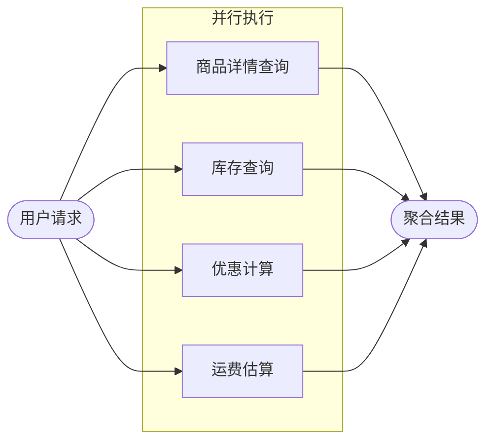
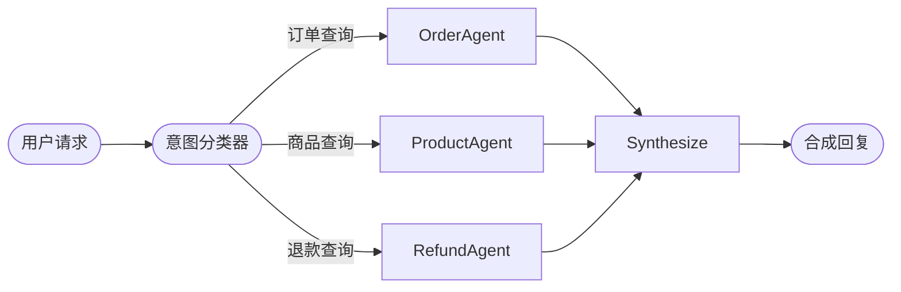

# 预置StateGraph构建函数

## 概述

LangGraph 是 LangChain 官方推出的编排框架，用于搭建复杂工作流。但在实际业务中，直接使用 LangGraph 往往需要编写较多样板代码（节点命名、边连接、图编译等）。

为降低上手成本，本库提供两个预置函数，用于快速构建顺序执行或并行执行的状态图。开发者只需专注于实现业务节点，其余编排工作由函数自动完成。

两个函数如下：

| 函数名 | 功能描述 | 适用场景 |
|----------|----------|----------|
| **create_sequential_graph** | 按顺序组合多个节点，形成顺序执行状态图 | 任务需按步骤执行且依赖前一步输出 |
| **create_parallel_graph** | 并行组合多个节点，形成并行执行状态图 | 多个任务相互独立，可同时执行以提高效率 |


## 顺序工作流

顺序工作流适用于“必须按步骤执行，且后一步依赖前一步输出”的场景。在 LangGraph 中，每一步通常对应一个状态图节点。

使用 `create_sequential_graph` 可将多个节点按固定顺序组合成状态图。

### 典型场景

以用户购买商品为例，典型流程如下：


该流程环环相扣，顺序不可颠倒。

其中这四个环节（库存确认、创建订单、完成支付、确认发货）可抽象为独立节点，并由专属智能体负责执行。
使用 `create_sequential_graph` 将四个节点按顺序连接，即可形成高度自动化、职责清晰的商品购买工作流。


下面示例展示如何用 `create_sequential_graph` 构建商品购买的顺序工作流。

先创建对话模型对象。这里以接入本地 vLLM 部署的 `qwen3-4b` 为例，其接口与 OpenAI 兼容，因此可直接用 `create_openai_compatible_model` 构建模型类。

```python
from langchain_dev_utils.chat_models.adapters import create_openai_compatible_model

ChatVLLM = create_openai_compatible_model(
    model_provider="vllm",
    base_url="http://localhost:8000/v1",
    chat_model_cls_name="ChatVLLM",
)
```
再实例化一个 `ChatVLLM` 对象，供后续智能体调用。

```python
model = ChatVLLM(model="qwen3-4b")
```
随后创建相关工具，例如查询库存、创建订单、进行支付等。

??? example "工具的实现参考"

    ```python
    from langchain_core.tools import tool

    @tool
    def check_inventory(product_name: str) -> dict:
        """查询库存"""
        return {"product_name": product_name, "in_stock": True, "available": 42}

    @tool
    def create_order(product_name: str, quantity: int) -> str:
        """创建订单"""
        return f"已创建订单 ORD-10001，商品：{product_name}，数量：{quantity}。"

    @tool
    def pay_order(order_id: str) -> str:
        """支付订单"""
        return f"订单 {order_id} 支付成功。"

    @tool
    def confirm_delivery(order_id: str, address: str) -> str:
        """确认发货"""
        return f"订单 {order_id} 已安排发货，收货地址：{address}。"
    ```

然后创建对应的四个子智能体以及对应的调用此智能体的节点函数。

```python
from langchain.agents import create_agent

inventory_agent = create_agent(
    model=model,
    tools=[check_inventory],
    system_prompt="你是库存助手，负责确认商品是否有货。最终请输出库存查询结果。",
    name="inventory_agent",
)

order_agent = create_agent(
    model=model,
    tools=[create_order],
    system_prompt="你是下单助手，负责创建订单。",
    name="order_agent"
)

payment_agent = create_agent(
    model=model,
    tools=[pay_order],
    system_prompt="你是支付助手，负责完成支付。",
    name="payment_agent"
)

delivery_agent = create_agent(
    model=model,
    tools=[confirm_delivery],
    system_prompt=(
        "你是发货助手，负责确认发货信息后安排发货。"
    ),
    name="delivery_agent",
    state_schema=AgentState
)

def inventory(state: AgentState):
    response = inventory_agent.invoke({"messages": state["messages"]})
    return {"messages": [AIMessage(content=response["messages"][-1].content)]}

def order(state: AgentState):
    response = order_agent.invoke({"messages": state["messages"]})
    return {"messages": [AIMessage(content=response["messages"][-1].content)]}
    
def payment(state: AgentState):
    response = payment_agent.invoke({"messages": state["messages"]})
    return {"messages": [AIMessage(content=response["messages"][-1].content)]}
    
def delivery(state: AgentState):
    response = delivery_agent.invoke({"messages": state["messages"]})
    return {"messages": [AIMessage(content=response["messages"][-1].content)]}
```

!!! info "注意"

    虽然 LangGraph 可直接将智能体（子图）作为节点加入图中，但这样会导致当前智能体的上下文中包含先前智能体的全部运行上下文，违背上下文工程管理的最佳实践。因此推荐将智能体封装在节点内部，仅输出最终结果。

最后使用 `create_sequential_graph` 将这四个节点按顺序连接成状态图。

```python
from langchain_dev_utils.graph import create_sequential_graph

graph = create_sequential_graph(
    nodes=[
        inventory,
        order,
        payment,
        delivery,
    ],
    state_schema=AgentState
)
```
运行示例：

```python
response = graph.invoke(
    {
        "messages": [
            HumanMessage("我要买一副无线耳机，数量2，请下单，收货地址是X市X区X路X号")
        ]
    }
)
print(response)
```


## 并行工作流

并行工作流适用于“多个任务相互独立、可同时执行”的场景，通过并发执行提升整体吞吐或降低端到端耗时。

使用 `create_parallel_graph` 可将多个节点以并行方式组合成状态图。

### 典型场景

在商品购买场景中，用户可能同时需要多种查询，例如商品详情、库存、优惠与运费估算，可并行执行。

流程如下：



接下来，我们创建一个并行工作流，用于实现上述流程。

先创建几个工具。

??? example "工具的实现参考"

    ```python
    @tool
    def get_product_detail(product_name: str) -> dict:
        """查询商品详情"""
        return {
            "product_name": product_name,
            "sku": "SKU-10001",
            "price": 299,
            "highlights": ["主动降噪", "蓝牙5.3", "30小时续航"],
        }

    @tool
    def check_inventory(product_name: str) -> dict:
        """查询库存"""
        return {"product_name": product_name, "in_stock": True, "available": 42}

    @tool
    def calculate_promotions(product_name: str, quantity: int) -> dict:
        """计算优惠"""
        return {
            "product_name": product_name,
            "quantity": quantity,
            "discounts": ["满300减30", "会员95折"],
            "estimated_discount": 45,
        }

    @tool
    def estimate_shipping(address: str) -> dict:
        """估算运费和时效"""
        return {
            "address": address,
            "fee": 12,
            "eta_days": 2,
        }
    ```

以及对应的子智能体：

```python
product_agent = create_agent(
    model,
    tools=[get_product_detail],
    system_prompt="你是商品助理，负责解析用户需求并查询商品详情。",
    name="product_agent",
    state_schema=AgentState,
)

inventory_agent = create_agent(
    model,
    tools=[check_inventory],
    system_prompt="你是库存助理，负责根据SKU查询库存。",
    name="inventory_agent",
    state_schema=AgentState,
)

promotion_agent = create_agent(
    model,
    tools=[calculate_promotions],
    system_prompt="你是优惠助理，负责计算当前可用优惠和预计折扣。",
    name="promotion_agent",
    state_schema=AgentState,
)

shipping_agent = create_agent(
    model,
    tools=[estimate_shipping],
    system_prompt="你是配送助理，负责估算运费和时效。",
    name="shipping_agent",
    state_schema=AgentState,
)

def product(state: AgentState):
    response = product_agent.invoke({"messages": state["messages"]})
    return {"messages": [AIMessage(content=response["messages"][-1].content)]}

def inventory(state: AgentState):
    response = inventory_agent.invoke({"messages": state["messages"]})
    return {"messages": [AIMessage(content=response["messages"][-1].content)]}

def promotion(state: AgentState):
    response = promotion_agent.invoke({"messages": state["messages"]})
    return {"messages": [AIMessage(content=response["messages"][-1].content)]}

def shipping(state: AgentState):
    response = shipping_agent.invoke({"messages": state["messages"]})
    return {"messages": [AIMessage(content=response["messages"][-1].content)]}
```

用 `create_parallel_graph` 完成并行状态图的编排。

```python
from langchain_dev_utils.graph import create_parallel_graph

graph = create_parallel_graph(
    nodes=[
       product,
       inventory,
       promotion,
       shipping,
    ],
    state_schema=AgentState,
    graph_name="parallel_graph",
)
```
运行示例：

```python
response = graph.invoke(
    {"messages": [HumanMessage("我想买一副无线耳机，数量2，收货地址X市X区X路X号")]}
)
print(response)
```


### 按需并行

有些情况下，并不希望所有节点都参与并行执行，而是希望“按条件选择其中部分节点并行运行”。此时可通过 `branches_fn` 指定分支函数。

分支函数需要返回 `Send` 列表，每个 `Send` 包含目标节点名称与该节点的输入。


####  Router 多智能体架构

按需并行功能可用于实现 Router 多智能体架构的核心部分。

在多智能体系统中，`Router`（路由）架构通过将复杂任务拆解并分发给专门的子智能体，实现高效的并行处理。该架构包含三个核心步骤：

1.  **意图识别**：由路由模型分析用户请求，拆解任务并确定调用的智能体。

2.  **并行执行**：多个业务智能体同时处理子任务。

3.  **结果汇总**：将各子智能体的回复整合成最终答案。

在订单查询场景中，用户可能同时关心订单状态、商品信息或退款政策。此时，系统可以并行调用订单、商品和退款智能体，最后统一回复。




**1. 环境准备与工具定义**

首先，定义各业务智能体需要用到的工具。

??? example "点击展开工具实现代码"

    ```python
    from langchain_core.tools import tool

    @tool
    def list_orders() -> dict:
        """查询用户订单列表"""
        return {
            "orders": [
                {
                    "order_id": "ORD-20250101-0001",
                    "status": "已发货",
                    "items": [{"product_name": "无线耳机", "qty": 1}],
                    "created_at": "2025-01-01 10:02:11",
                },
                {
                    "order_id": "ORD-20241215-0234",
                    "status": "已完成",
                    "items": [{"product_name": "机械键盘", "qty": 1}],
                    "created_at": "2024-12-15 21:18:03",
                },
            ],
        }

    @tool
    def get_order_detail(order_id: str) -> dict:
        """查询订单详情"""
        return {
            "status": "已发货",
            "receiver": {"name": "张三", "phone": "138****0000"},
            "items": [
                {
                    "product_id": "P-10001",
                    "product_name": "无线耳机",
                    "qty": 1,
                    "price": 299,
                }
            ],
        }

    @tool
    def get_shipping_trace(tracking_no: str) -> dict:
        """查询物流轨迹"""
        return {
            "events": [
                {"time": "2025-01-02 09:10", "status": "快件已揽收"},
                {"time": "2025-01-02 18:45", "status": "快件运输中"},
                {"time": "2025-01-03 11:20", "status": "快件已到达派送站"},
            ],
        }

    @tool
    def search_products(query: str) -> dict:
        """搜索产品"""
        return {
            "results": [
                {
                    "product_id": "P-10001",
                    "name": "无线耳机 Pro",
                    "price": 299,
                    "highlights": ["降噪", "蓝牙5.3", "续航30小时"],
                },
                {
                    "product_id": "P-10002",
                    "name": "无线耳机 Lite",
                    "price": 199,
                    "highlights": ["轻量", "低延迟", "续航24小时"],
                },
            ],
        }

    @tool
    def get_product_detail(product_id: str) -> dict:
        """查询产品详情"""
        return {
            "product_id": product_id,
            "name": "无线耳机 Pro",
            "price": 299,
            "specs": {"color": ["黑", "白"], "warranty_months": 12},
            "description": "主打降噪与长续航的真无线耳机。",
        }

    @tool
    def check_inventory(product_name: str) -> dict:
        """查询库存"""
        return {"product_name": product_name, "in_stock": True, "available": 42}

    @tool
    def create_refund(order_id: str, reason: str) -> dict:
        """发起退款"""
        return {
            "refund_id": "RFD-20250103-0009",
            "status": "已提交",
            "reason": reason,
            "estimated_days": 3,
        }

    @tool
    def get_refund_status(refund_id: str) -> dict:
        """查询退款状态"""
        return {
            "refund_id": refund_id,
            "status": "处理中",
            "progress": [
                {"time": "2025-01-03 12:05", "status": "已提交"},
                {"time": "2025-01-03 12:20", "status": "客服审核中"},
            ],
            "estimated_days": 2,
        }

    @tool
    def refund_policy() -> dict:
        """查看退款政策"""
        return {
            "window_days": 7,
            "requirements": ["商品完好", "配件齐全", "提供订单号"],
            "notes": ["部分活动商品不支持无理由退款", "到账时间视支付渠道而定"],
        }
    ```

**2. 定义状态 Schema**

`RouterState` 代表最终状态图的状态Schema，而`AgentInput` 与 `AgentOutput` 分别定义子智能体节点的输入与输出状态。

```python
import operator
from typing import Annotated, Literal

from typing_extensions import TypedDict


class AgentInput(TypedDict):
    """子智能体的输入结构"""
    query: str


class AgentOutput(TypedDict):
    """子智能体的输出结构"""
    source: str
    result: str


class Classification(TypedDict):
    """路由分类结果"""
    source: Literal["order", "refund", "product"]
    query: str


class RouterState(TypedDict):
    """全局状态 Schema"""
    query: str
    classifications: list[Classification]
    results: Annotated[list[AgentOutput], operator.add] 
    final_answer: str
```

**3. 创建子智能体**

利用 LangChain 的 `create_agent` 快速构建三个业务智能体，并为它们绑定对应的工具和提示词。

```python
from langchain.agents import create_agent
from langchain_core.messages import HumanMessage

ORDER_AGENT_PROMPT = (
    "你是订单管理助手。\n"
    "你可以使用工具来查询订单列表、订单详情、物流轨迹。\n"
    "优先使用工具获取信息，再基于工具结果给出结论。\n"
    "输出要求：用中文回答，结构清晰，必要时用条目列出订单信息。\n"
)

order_agent = create_agent(
    model,
    system_prompt=ORDER_AGENT_PROMPT,
    tools=[list_orders, get_order_detail, get_shipping_trace],
    name="order_agent",
)

PRODUCT_AGENT_PROMPT = (
    "你是产品管理助手。\n"
    "你可以使用工具来搜索产品、查看产品详情、查询库存。\n"
    "优先使用工具获取信息，再基于工具结果给出建议。\n"
    "当用户的需求不明确时，先提出一个澄清问题（例如品类/预算/用途）。\n"
    "输出要求：用中文回答，给出可执行的下一步建议。\n"
)

product_agent = create_agent(
    model,
    system_prompt=PRODUCT_AGENT_PROMPT,
    tools=[search_products, get_product_detail, check_inventory],
    name="product_agent",
)

REFUND_AGENT_PROMPT = (
    "你是退款管理助手。\n"
    "你可以使用工具来发起退款、查询退款状态、查看退款政策。\n"
    "优先使用工具获取信息；若用户缺少关键字段（例如订单号），先追问。\n"
    "输出要求：用中文回答，明确告知退款进度/所需材料/预计时间。\n"
)

refund_agent = create_agent(
    model,
    system_prompt=REFUND_AGENT_PROMPT,
    tools=[create_refund, get_refund_status, refund_policy],
    name="refund_agent",
)
```

**4. 封装智能体调用逻辑**

将智能体的调用逻辑封装为节点函数。每个函数负责调用特定的智能体，并将结果格式化写入 `results` 字段。

```python
def order_node(state: AgentInput):
    response = order_agent.invoke({"messages": [HumanMessage(content=state["query"])]})
    return {
        "results": [{"source": "order", "result": response["messages"][-1].content}]
    }

def product_node(state: AgentInput):
    response = product_agent.invoke(
        {"messages": [HumanMessage(content=state["query"])]}
    )
    return {
        "results": [{"source": "product", "result": response["messages"][-1].content}]
    }

def refund_node(state: AgentInput):
    response = refund_agent.invoke({"messages": [HumanMessage(content=state["query"])]})
    return {
        "results": [{"source": "refund", "result": response["messages"][-1].content}]
    }
```

**5. 实现路由与分支逻辑**

这里就需要使用**按需并行**的功能。我们定义两个节点：
1.  **`classify_query`**：使用大模型进行意图识别，输出需要调用的智能体列表以及任务内容。
2.  **`route_to_agents`**：根据分类结果，生成 `Send` 对象列表，决定并行执行哪些节点。

```python
from typing import cast
from langchain_core.messages import SystemMessage
from pydantic import BaseModel, Field
from langgraph.constants import Send

class ClassificationResult(BaseModel):
    classifications: list[Classification] = Field(
        description="要调用的智能体列表及其对应的子问题"
    )

ROUTER_SYSTEM_PROMPT = (
    "你是一个Router模型，只负责把用户问题拆分并分发到合适的业务子智能体。\n"
    "可选的业务域只有：order（订单）、product（产品）、refund（退款）。\n"
    "你必须输出一个 classifications 列表（用于并行调用多个子智能体）。\n"
    "规则：\n"
    "1) source 必须是上述三个之一；\n"
    "2) query 必须是发给该子智能体的、可直接执行的任务描述；\n"
    "3) 如果用户一句话中同时涉及多个业务域（例如‘查订单’+‘看产品’+‘问退款’），必须拆成多个 classification，以便并行执行；\n"
    "4) 如果无法判断，优先选择 product，并把问题原样交给它。\n"
    "示例A：用户：‘查一下ORD-1物流，并看看这款耳机有没有货’ -> 返回2条：order(查询物流)+product(查询库存)。\n"
    "示例B：用户：‘我想退ORD-1，退款多久到账’ -> 返回1条：refund(发起/查询退款)。\n"
    "示例C：用户：‘我想知道这款耳机的规格’ -> 返回1条：product(查询详情)。\n"
)

def classify_query(state: RouterState):
    structured_llm = model.with_structured_output(ClassificationResult)

    classify_result = cast(
        ClassificationResult,
        structured_llm.invoke(
            [
                SystemMessage(ROUTER_SYSTEM_PROMPT),
                HumanMessage(state["query"]),
            ]
        ),
    )

    return {"classifications": classify_result.classifications}

def route_to_agents(state: RouterState) -> list[Send]:
    """根据分类结果生成并行执行的指令"""
    return [Send(c["source"], {"query": c["query"]}) for c in state["classifications"]]
```

**6. 编排并行图与汇总**

使用 `create_parallel_graph` 创建并行子图。这里传入 `branches_fn` 参数，实现了根据条件的动态并行执行。

```python hl_lines="10"
from langchain_dev_utils.graph import create_parallel_graph

router_graph = create_parallel_graph(
    nodes=[
        order_node,
        product_node,
        refund_node,
    ],
    state_schema=RouterState,
    branches_fn=route_to_agents, # 核心逻辑：由函数决定运行哪些分支
)
```

接下来编写汇总节点 `synthesize_results`，用于将并行执行的结果整合为通顺的回答。

```python
SYNTHESIS_SYSTEM_PROMPT = (
    "综合这些结果以回答原始问题：{query}\n"
    "- 合并来自多个来源的信息，避免冗余\n"
    "- 突出最相关且可操作的信息\n"
    "- 注明来源之间的任何差异\n"
    "- 保持回答简洁且条理清晰\n"
)

def synthesize_results(state: RouterState) -> dict:
    if not state["results"]:
        return {"final_answer": "No results found from any knowledge source."}

    # 格式化各子智能体的输出
    formatted = [
        f"**From {r['source'].title()}:**\n{r['result']}" for r in state["results"]
    ]

    synthesis_response = model.invoke(
        [
            {
                "role": "system",
                "content": SYNTHESIS_SYSTEM_PROMPT.format(query=state["query"]),
            },
            {"role": "user", "content": "\n\n".join(formatted)},
        ]
    )

    return {"final_answer": synthesis_response.content}
```

**7. 构建最终的StateGraph**

最后，使用 `create_sequential_graph` 将“意图分类 -> 按需并行 -> 结果汇总”串联起来，形成完整的应用流。

```python
from langchain_dev_utils.graph import create_sequential_graph

graph = create_sequential_graph(
    nodes=[
        classify_query,
        router_graph,
        synthesize_results,
    ],
    state_schema=RouterState,
)
```

**8. 运行示例**

```python
# 示例 1：单一意图（产品查询）
response = graph.invoke({"query": "你好，我要查询一下之前购买的产品"})
print(response["final_answer"])

# 示例 2：混合意图（产品查询 + 退款政策），将触发并行执行
response = graph.invoke({"query": "推荐一款适合通勤的无线耳机并看看库存；同时，告诉我你们商品的退款政策？"})
print(response["final_answer"])
```

