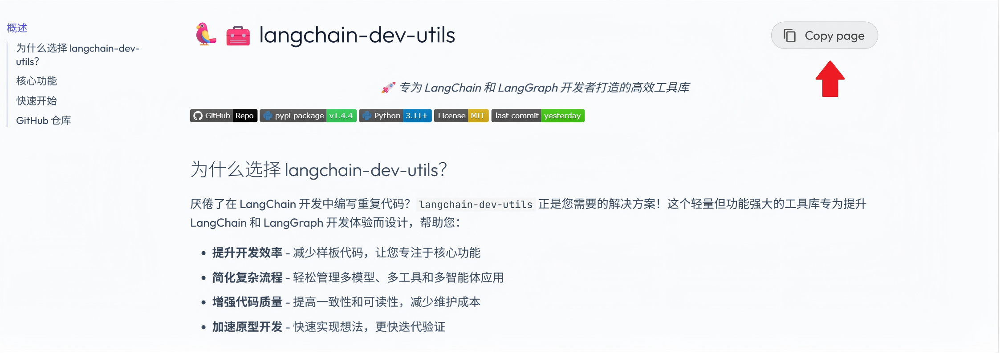

# 以编程方式调用文档

本文档旨在深度集成 AI 工作流。您可以通过 AI 助手、IDE 插件或 Model Context Protocol (MCP) 将本文档无缝接入开发环境，实现高效、自动化的内容检索与调用。

## 快速获取 Markdown 内容

文档页面右上角提供了便捷的**复制按钮**：

  

**操作步骤：**

1. 点击右上角的复制按钮。

2. 当前页面的完整 Markdown 内容将自动复制至剪贴板。

3. 您可直接将其粘贴至代码编辑器（如 VS Code）或 AI 助手（如 ChatGPT、Claude）的对话框中开始使用。

## 通过 MCP 集成

本文档已同步至 [Context7](https://context7.com/) 平台，支持通过 Model Context Protocol (MCP) 工具进行直接调用。

**如何配置：**
请参阅 [Context7 MCP 工具配置文档](https://context7.com/docs)，了解如何在您的代码编辑器或 AI 助手中完成 MCP 工具的连接与配置。

!!! note "检索提示"
    由于 Context7 文档库收录了本项目的三个历史版本，为了确保 AI 获取的是最新内容，建议在提示词中明确指定：**“请优先查阅最新更新的文档版本”**。

## 最佳实践建议

鉴于 Context7 的内容同步周期约为 2 周，检索结果可能存在时效性差异。**为确保内容的准确性与实时性，强烈建议优先使用页面右上角的“复制”按钮**获取最新 Markdown 内容，而非依赖 Context7 的缓存数据。
